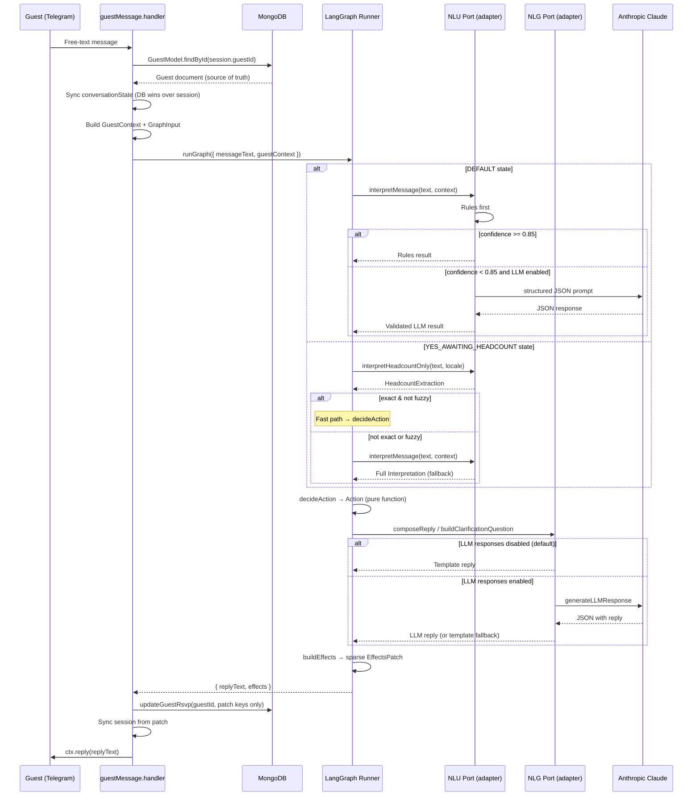

# System Architecture

> Part of the [EZ-Event-BOT documentation](README.md).

## 1. Project Overview & Motivation

### 1.1 Problem Statement

Event organizers need to collect RSVP responses from invited guests. Traditional methods — web forms, phone calls, messaging broadcast — suffer from low engagement, friction, and manual tracking overhead. This project addresses the problem by delivering a **conversational AI agent over Telegram**: guests receive a personalized invite link, click it, and respond in natural free-text Hebrew (or English). The system understands their response and records it automatically.

The core technical challenge is **Natural Language Understanding (NLU) in Hebrew**: guests respond with colloquial expressions, abbreviations, ambiguous phrasing, and varying levels of specificity.

| Guest Message | Expected Interpretation |
|---|---|
| "כן מגיע" (Yes, coming) | RSVP: YES, headcount unknown |
| "אנחנו זוג" (We're a couple) | RSVP: YES, headcount: 2 |
| "תלוי בעבודה, עוד לא סגור" (Depends on work) | RSVP: MAYBE |
| "אני ואשתי ו-2 ילדים" (Me, wife, and 2 kids) | RSVP: YES, headcount: 4 |
| "אופס טעיתי, נהיה 2" (Oops, mistake, we'll be 2) | Headcount correction to 2, keep YES |

### 1.2 Research Context

This system makes a deliberate architectural contribution: a **rules-first, LLM-fallback** hybrid pipeline. A purely rule-based system handles common patterns well but fails on nuanced or unusual phrasing. A purely LLM-based system introduces latency, cost, and non-determinism. The hybrid yields:

- **Deterministic behavior** for ~80-90% of messages (common RSVP patterns via rules)
- **LLM handling** for the long tail of ambiguous, compound, or unusual messages
- **Graceful degradation** — every LLM integration point has a fallback, so the system always produces a reply

---

## 2. High-Level Architecture

The system has three main actors and two runtime processes:

```
┌─────────────────────┐           ┌─────────────────────┐
│   Event Organizer   │           │   Guest (Telegram)  │
│  (Browser / cURL)   │           └──────────┬──────────┘
└──────────┬──────────┘                      │ Telegram Bot API
           │ HTTP REST API                   ▼
           ▼                      ┌─────────────────────┐
┌─────────────────────┐           │   Telegraf Handler  │
│  Express HTTP Server│           │   (bot layer)       │
│  Campaign CRUD      │           │   Session Mgmt      │
│  Link Generation    │           │   EffectsPatch Apply│
└──────────┬──────────┘           └──────────┬──────────┘
           │                                 │ GraphInput
           │  MongoDB                        ▼
           ├────────────────► ┌─────────────────────────┐
           │                  │  LangGraph State Graph   │
           │                  │  (domain layer)          │
           │                  │  interpretFull           │
           │                  │  interpretHeadcount      │
           │                  │  decideAction            │
           │                  │  composeReply            │
           │                  │  buildEffects            │
           │                  └──────────┬──────────────┘
           │                             │ via Port Adapters
           │                             ▼
           │                  ┌──────────┴──────────┐
           │                  │ NLU Pipeline         │  ┌──────────────────┐
           │                  │ - Rule-based parser  ├─►│ Anthropic Claude │
           │                  │ - LLM fallback       │  │ claude-3-haiku   │
           │                  │ NLG Pipeline         │  └──────────────────┘
           │                  │ - Templates (default)│
           │                  │ - LLM responses (opt)│
           │                  └─────────────────────┘
           ▼
┌─────────────────────┐
│   MongoDB Database  │
│   Campaigns         │
│   Guests            │
│   Invites (tokens)  │
└─────────────────────┘
```

**Two runtime processes:**
- **`bot-service`** (Node.js): Express HTTP server + Telegraf Telegram bot + LangGraph RSVP agent
- **`admin-web`** (Vite dev server / static build): Vue 3 admin dashboard

---

## 3. Layered Architecture & Boundary Rules

The codebase enforces **strict import boundaries** between three layers:

```
┌──────────────────────────────────────────────────────────┐
│  INFRASTRUCTURE LAYER                                    │
│  bot/handlers/       bot/adapters/    http/routes/       │
│  (Telegraf, session, (NluAdapter,     (Express routes,   │
│   MongoDB writes,    NlgAdapter —      Campaign CRUD)    │
│   EffectsPatch apply) bridge to domain)                  │
│  Imports: telegraf, mongoose, domain/*                   │
├──────────────────────────────────────────────────────────┤
│  DOMAIN LAYER                                            │
│  domain/rsvp-graph/               domain/rsvp/          │
│  (LangGraph state graph,          (Shared types:         │
│   nodes, ports, effects)          RsvpStatus,            │
│  Imports: @langchain/langgraph,    Interpretation,        │
│   domain/rsvp/*                    HeadcountExtraction)  │
│  ❌ NEVER: bot/*, mongoose,       Imports: nothing       │
│            telegraf, new Date()                          │
└──────────────────────────────────────────────────────────┘
```

**Boundary rules** (verifiable by grep):

| Rule | Checked By |
|---|---|
| `domain/rsvp-graph/**` never imports from `bot/` | grep |
| `domain/rsvp-graph/**` never imports `mongoose` or `telegraf` | grep |
| `domain/rsvp-graph/**` never calls `new Date()` | grep |

All time values flow through `ClockPort.now()`, making the domain layer fully deterministic in tests. All external capabilities (NLU, NLG, clock, logger) are accessed through **port interfaces** defined in `domain/rsvp-graph/ports.ts`.

---

## 4. Technology Stack

### Backend (bot-service)

| Technology | Version | Purpose |
|---|---|---|
| Node.js | 22+ | Runtime (ESM modules) |
| TypeScript | 5.3+ | Type safety, strict mode |
| Express.js | 4.x | HTTP API server |
| Telegraf | 4.x | Telegram bot framework |
| LangGraph (`@langchain/langgraph`) | latest | RSVP state graph orchestration |
| Mongoose | 8.x | MongoDB ODM |
| Zod | 3.x | Schema validation (API + LLM responses) |
| Pino | 9.x | Structured logging |
| Anthropic SDK | latest | Claude 3 Haiku LLM |

**LLM model**: `claude-3-haiku-20240307` — chosen for classification tasks: low latency (~200-500ms), low cost (~10x cheaper than Sonnet), sufficient capability for short Hebrew RSVP parsing.

### Frontend (admin-web)

| Technology | Purpose |
|---|---|
| Vue 3 (Composition API) | UI framework |
| Vite | Build tool and dev server |
| Tailwind CSS 4 | Styling with custom design tokens |
| Pinia | State management |
| Vue Router | Client-side routing |
| vue-i18n | Hebrew/English internationalization |
| Axios | HTTP client with interceptors |
| PapaParse | CSV parsing for guest import |
| date-fns | Date formatting |

---

## 5. Monorepo Structure

```
EZ-Event-BOT/
├── package.json               ← npm workspaces root
├── tsconfig.base.json         ← Shared TypeScript config
├── .env                       ← Environment variables (git-ignored)
├── apps/
│   ├── bot-service/
│   │   ├── package.json
│   │   ├── tsconfig.json
│   │   ├── .env.example
│   │   └── src/
│   │       ├── index.ts               ← Bootstrap: DB + bot + HTTP
│   │       ├── config/env.ts          ← Zod-validated environment
│   │       ├── db/mongo.ts            ← MongoDB connection
│   │       ├── logger/logger.ts       ← Pino logger
│   │       ├── http/                  ← Express server + routes
│   │       ├── domain/                ← Business logic (pure)
│   │       ├── bot/                   ← Telegraf + RSVP handlers
│   │       └── infra/llm/             ← Anthropic client
│   └── admin-web/
│       ├── package.json
│       ├── vite.config.js
│       └── src/
│           ├── main.js, App.vue
│           ├── router/, stores/, views/, components/
│           ├── api/, composables/, i18n/, utils/
│           └── styles/
└── packages/
    └── shared/                ← Placeholder (empty)
```

---

## 6. Component Inventory

### Domain Layer — Pure, no infrastructure imports

| Component | File | Responsibility |
|---|---|---|
| Shared Domain Types | `domain/rsvp/types.ts` | `RsvpStatus`, `ConversationState`, `HeadcountExtraction`, `Interpretation`, `AmbiguityReason` |
| Graph Types | `domain/rsvp-graph/types.ts` | `GuestContext`, `Action` (6-variant union), `EffectsPatch`, `GraphInput`/`GraphOutput` |
| Port Interfaces | `domain/rsvp-graph/ports.ts` | `NluPort`, `NlgPort`, `ClockPort`, `LoggerPort`, `RsvpGraphPorts` |
| State Annotation | `domain/rsvp-graph/state.ts` | LangGraph `RsvpAnnotation` — 7-channel state definition |
| `interpretFull` node | `domain/rsvp-graph/nodes/interpretFull.ts` | Calls `ports.nlu.interpretMessage()`, sets `interpretation` |
| `interpretHeadcount` node | `domain/rsvp-graph/nodes/interpretHeadcount.ts` | Calls `ports.nlu.interpretHeadcountOnly()`, sets `headcountExtraction` |
| `decideAction` node | `domain/rsvp-graph/nodes/decideAction.ts` | **All business logic** — change detection, policy rules, produces `Action`. Pure function. |
| `composeReply` node | `domain/rsvp-graph/nodes/composeReply.ts` | Switches on `action.type`, delegates to `ports.nlg` |
| `buildEffects` node | `domain/rsvp-graph/nodes/buildEffects.ts` | Maps `Action` + `GuestContext` → sparse `EffectsPatch` via `ClockPort` |
| Graph Definition | `domain/rsvp-graph/graph.ts` | LangGraph `StateGraph` with conditional routing, compiled once |
| Graph Runner | `domain/rsvp-graph/index.ts` | `createRsvpGraphRunner()` — singleton factory |

### Bot Layer — Infrastructure, adapters, Telegraf

| Component | File | Responsibility |
|---|---|---|
| Message Handler | `bot/handlers/guestMessage.handler.ts` | Session check, DB fetch, builds `GuestContext`, calls graph runner, applies `EffectsPatch`, sends reply |
| Start Handler | `bot/handlers/start.handler.ts` | `/start` command: token lookup, session init, personalized invitation |
| NLU Adapter | `bot/adapters/nluAdapter.ts` | Implements `NluPort` — wraps `interpret/` functions |
| NLG Adapter | `bot/adapters/nlgAdapter.ts` | Implements `NlgPort` — wraps `respond/` functions |
| Rule-Based Interpreter | `bot/rsvp/interpret/rules.ts` | Deterministic Hebrew/English NLP, 14-step headcount extraction, fuzzy matching |
| LLM Interpreter | `bot/rsvp/interpret/llmInterpreter.ts` | Anthropic Claude fallback with Zod validation |
| Interpretation Pipeline | `bot/rsvp/interpret/index.ts` | Routes between rules and LLM based on confidence threshold |
| Headcount-Only Extractor | `bot/rsvp/interpret/headcountOnly.ts` | Focused extraction for `YES_AWAITING_HEADCOUNT` state |
| Response Composer | `bot/rsvp/respond/index.ts` | Routes between templates and LLM responses |
| Template Engine | `bot/rsvp/respond/templates.ts` | Static Hebrew reply templates |
| LLM Responder | `bot/rsvp/respond/llmResponder.ts` | LLM-generated natural replies |
| Clarification Builder | `bot/rsvp/clarificationQuestions.ts` | Adaptive 3-attempt headcount clarification |

### Infrastructure Layer

| Component | File | Responsibility |
|---|---|---|
| Anthropic Client | `infra/llm/anthropic.ts` | SDK singleton, `claude-3-haiku-20240307`, temperature 0.2 |
| LLM Client | `infra/llm/llmClient.ts` | 10s timeout, 1 retry, retryable error classification |
| Environment Config | `config/env.ts` | Zod schema with cross-field validation (API key required when LLM enabled) |
| Campaign Routes | `http/routes/campaignRoutes.ts` | Express routes for Campaign CRUD and link generation |

---

## 7. Design Principles

### 7.1 Rules-First, LLM-Fallback

Every incoming message is processed by the deterministic rule-based interpreter. Only when confidence falls below the threshold (default 0.85) does the system invoke the LLM. This yields low latency and zero API cost for ~80-90% of messages, while maintaining quality for the long tail.

### 7.2 Hexagonal Architecture (Ports & Adapters)

The domain layer (`domain/rsvp-graph/`) defines **port interfaces** for all external capabilities. Concrete implementations live in the bot layer as **adapters**. This enables:
- Testing the domain graph in complete isolation with mock ports
- Swapping NLU or NLG implementations without touching domain logic

### 7.3 Sparse EffectsPatch

Actions produce a sparse `EffectsPatch` — only keys that should change are present. The handler iterates patch keys and writes only those to MongoDB. This prevents accidental overwrites (e.g., `ACK_NO_CHANGE` only touches `lastResponseAt`).

### 7.4 ClockPort Eliminates Implicit Time

The domain graph never calls `new Date()`. All timestamps come from `ClockPort.now()`, injected by the bot layer. This makes unit tests on `EffectsPatch` timestamps exact and deterministic.

### 7.5 Never Guess

When headcount is ambiguous ("אני והילדים" — me and the kids), the system classifies it as `ambiguous:FAMILY_TERM` and asks a targeted clarification question. It never assumes a number. This conservative philosophy ensures data accuracy over conversational brevity.

### 7.6 Graceful Degradation

Every LLM integration point has an explicit fallback:

| Component | LLM Failure Fallback |
|---|---|
| Interpretation pipeline | Returns rules result (even if low confidence) |
| LLM interpreter | Returns `UNKNOWN` with confidence 0.2 |
| Response composer | Falls back to template replies |
| Headcount-only extractor | Returns rules extraction result |

The system always produces a reply, even if every LLM call fails.

---

## 8. Full Message Lifecycle



---

## 9. Configuration & Feature Flags

| Variable | Default | Description |
|---|---|---|
| `ANTHROPIC_API_KEY` | — | Required when `RSVP_USE_LLM_INTERPRETATION=true` |
| `RSVP_USE_LLM_INTERPRETATION` | `true` | Enable LLM fallback for interpretation |
| `RSVP_USE_LLM_RESPONSES` | `false` | Enable LLM-generated reply text |
| `RSVP_CONFIDENCE_THRESHOLD` | `0.85` | Minimum rules confidence to skip LLM |

### Operating Modes

| Mode | `LLM_INTERPRETATION` | `LLM_RESPONSES` | Behavior |
|---|---|---|---|
| Rules-only | `false` | `false` | Zero LLM calls. Fully deterministic. |
| **Hybrid (default)** | `true` | `false` | LLM for ambiguous messages; templates for all replies. |
| Full LLM | `true` | `true` | LLM for interpretation and response. Most natural, highest cost. |
