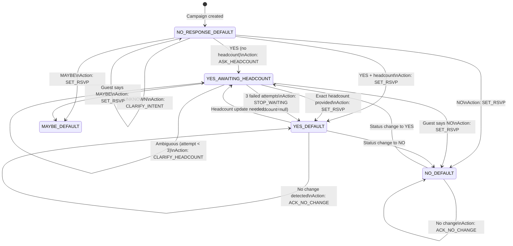

# RSVP Business Logic & Guest Record Lifecycle

> Part of the [EZ-Event-BOT documentation](README.md).
> See also: [05-langgraph-agent.md](05-langgraph-agent.md) for the LangGraph graph that executes this logic, [02-database-models.md](02-database-models.md) for the Guest schema.

## 1. Overview

The RSVP lifecycle describes the complete journey of a Guest record — from creation when a campaign is set up, through RSVP collection, headcount confirmation, possible updates and corrections, and final confirmed state. The system enforces strict business rules to ensure data accuracy while keeping the conversation natural and user-friendly.

A Guest record has **two interacting state dimensions**:
1. **`rsvpStatus`**: `NO_RESPONSE | YES | NO | MAYBE`
2. **`conversationState`**: `DEFAULT | YES_AWAITING_HEADCOUNT`

These two fields together define where the guest is in the conversation and what the bot will do with their next message.

---

## 2. Guest Record State Machine



**State labels** — format: `{rsvpStatus}_{conversationState}`:
- `NO_RESPONSE_DEFAULT` — Initial state for all new guests
- `YES_AWAITING_HEADCOUNT` — Guest confirmed YES, bot is awaiting headcount
- `YES_DEFAULT` / `NO_DEFAULT` / `MAYBE_DEFAULT` — Terminal confirmed states (conversation returns to DEFAULT)

---

## 3. Guest Record Fields & Semantics

| Field | Type | Default | Updated When |
|---|---|---|---|
| `_id` | ObjectId | auto | Never |
| `campaignId` | ObjectId | set at creation | Never |
| `name` | String | set at creation | Never |
| `phone` | String | set at creation | Never |
| `rsvpStatus` | `NO_RESPONSE\|YES\|NO\|MAYBE` | `NO_RESPONSE` | On meaningful RSVP change |
| `headcount` | Number\|null | `null` | When guest with YES provides count |
| `conversationState` | `DEFAULT\|YES_AWAITING_HEADCOUNT` | `DEFAULT` | On state transitions |
| `rsvpUpdatedAt` | Date\|null | `null` | Only when `rsvpStatus` OR `headcount` actually changes |
| `lastResponseAt` | Date\|null | `null` | Every time any message is processed (including ACK) |
| `createdAt` | Date | auto | Never |
| `updatedAt` | Date | auto | Every Mongoose save |

### Key Timestamp Distinction

**`rsvpUpdatedAt`** tracks *when the RSVP data last changed*. It is NOT updated on `ACK_NO_CHANGE`, `CLARIFY_INTENT`, or `CLARIFY_HEADCOUNT` — only on actual data changes (status transitions or headcount updates).

**`lastResponseAt`** tracks *when the guest last interacted*, regardless of whether the data changed. This enables the admin dashboard to differentiate "last RSVP change" from "last active conversation."

---

## 4. RSVP Collection Flow — Normal Paths

### 4.1 Guest Sends YES (Without Headcount)

```
Message: "כן מגיע"
  → Rules: YES, confidence 0.9 → threshold passed, no LLM call
  → decideAction: YES without headcount → Action: ASK_HEADCOUNT

EffectsPatch written:
  { rsvpStatus: YES, conversationState: YES_AWAITING_HEADCOUNT,
    lastResponseAt: now, rsvpUpdatedAt: now, clarificationAttempts: 0 }

Bot reply: "דוד כהן, כמה אנשים יגיעו?"
```

### 4.2 Guest Provides Headcount (In YES_AWAITING_HEADCOUNT State)

```
Message: "אנחנו זוג"
  → Graph routes to interpretHeadcount (headcount-only extraction)
  → "זוג" → kind: 'exact', headcount: 2 (priority chain step 5)
  → exact & !fuzzy → fast path directly to decideAction
  → Action: SET_RSVP { YES, headcount: 2 }

EffectsPatch written:
  { rsvpStatus: YES, headcount: 2, conversationState: DEFAULT,
    lastResponseAt: now, rsvpUpdatedAt: now, clarificationAttempts: 0 }

Bot reply: "תודה דוד כהן! נרשמת 2 אנשים."
```

### 4.3 Guest Sends YES + Headcount Together

```
Message: "כן, אנחנו 4"
  → Rules: YES, headcount = exact:4, confidence 0.9
  → decideAction: YES + exact headcount → Action: SET_RSVP { YES, headcount: 4 }

EffectsPatch written:
  { rsvpStatus: YES, headcount: 4, conversationState: DEFAULT,
    lastResponseAt: now, rsvpUpdatedAt: now }
```

### 4.4 Guest Sends NO

```
Message: "לא מגיע"
  → Rules: NO, confidence 0.9
  → Action: SET_RSVP { NO, null }

EffectsPatch written:
  { rsvpStatus: NO, conversationState: DEFAULT,
    lastResponseAt: now, rsvpUpdatedAt: now }
```

### 4.5 Guest Sends MAYBE

```
Message: "תלוי בעבודה, עוד לא סגור"
  → Rules: MAYBE, confidence 0.85 (meets threshold)
  → Action: SET_RSVP { MAYBE, null }

EffectsPatch written:
  { rsvpStatus: MAYBE, conversationState: DEFAULT,
    lastResponseAt: now, rsvpUpdatedAt: now }

Bot reply: "הבנתי, תודה. תעדכן אותי כשיהיה ברור."
```

### 4.6 Message Unclear

```
Message: "בסדר" (OK — ambiguous without context)
  → Rules: UNKNOWN, confidence 0.3 → LLM fallback
  → LLM: UNKNOWN, confidence 0.4 → Action: CLARIFY_INTENT

EffectsPatch written:
  { lastResponseAt: now }    ← ONLY lastResponseAt; nothing else changes

Bot reply: "דוד כהן, אנא ענה כן/לא/אולי."
```

---

## 5. Headcount Clarification Loop

When the guest is in `YES_AWAITING_HEADCOUNT` and their response does not contain a clear number, the bot enters a progressive clarification loop capped at **3 attempts**.

### Attempt Progression

| Attempt | Strategy | Trigger | Hebrew Example |
|---|---|---|---|
| 1 | Reason-specific question | Ambiguity reason (FAMILY_TERM, RELATIONAL, RANGE_OR_APPROX) | "מעולה! כמה ילדים יגיעו איתך? כלומר כמה תהיו סהכ?" |
| 2 | Simplified with example | Second failed attempt | "כדי לרשום נכון, אפשר מספר בלבד? למשל: 3" |
| 3 | Graceful exit | `clarificationAttempts >= 3` | "אין בעיה, אשאיר כרגע בלי מספר. תמיד אפשר לעדכן בהמשך." |

After 3 failed attempts, `STOP_WAITING_FOR_HEADCOUNT` is triggered:

```
Action: STOP_WAITING_FOR_HEADCOUNT

EffectsPatch written:
  { conversationState: DEFAULT, lastResponseAt: now, clarificationAttempts: 0 }
  ← rsvpStatus and headcount are INTENTIONALLY ABSENT
  ← Guest keeps YES status, headcount stays null
```

**UX Principle**: Never insist. After 3 attempts, accept that the guest cannot or will not provide a headcount, and allow them to move on. They can always update later.

### Clarification Attempt Tracking

```
Action: CLARIFY_HEADCOUNT

EffectsPatch written:
  { conversationState: YES_AWAITING_HEADCOUNT, lastResponseAt: now,
    clarificationAttempts: <incremented>, lastClarificationReason: <AmbiguityReason> }
```

---

## 6. Change Detection — RSVP Updates After Confirmation

Guests can update their RSVP at any time after confirmation. The `decideAction` node calls `detectChangeIntent()` — a multi-signal function that determines whether the guest intends to **update** vs. simply **reaffirm**.

### Signal Hierarchy

```
Message from a confirmed guest (YES or NO)
  │
  ├─ Explicit change keywords? → Change detected
  │  ("רק", "משנה", "מעדכן", "change", "update")
  │
  ├─ Current status = YES?
  │   ├─ New headcount differs from current? → Headcount update
  │   └─ Headcount-only message (UNKNOWN rsvp + no RSVP keywords)? → Headcount update
  │
  ├─ New rsvpStatus differs from current?
  │   ├─ Correction keyword + headcount + YES? → Headcount update (NOT status change)
  │   └─ Otherwise → Status change detected
  │
  └─ No signal → ACK_NO_CHANGE
```

### ACK_NO_CHANGE (Confirmed Guest Repeats Same Intent)

```
Guest: YES+headcount:2. New message: "כן מגיע"
  → decideAction: YES guest + no change detected → Action: ACK_NO_CHANGE

EffectsPatch written:
  { lastResponseAt: now }    ← ONLY; no status mutation

Bot reply: "תודה דוד כהן! כבר נרשמת 2 אנשים."
```

### Headcount Update

```
Guest: YES+headcount:2. Message: "רק 3 אנשים" (only 3 people)
  → Change keyword ("רק") + different headcount → headcount update
  → Action: SET_RSVP { YES, headcount: 3 }

EffectsPatch written:
  { rsvpStatus: YES, headcount: 3, conversationState: DEFAULT,
    lastResponseAt: now, rsvpUpdatedAt: now }
```

### Critical Edge Case — Correction Overrides Status Change

```
Guest: YES+headcount:4. Message: "אופס טעיתי, נהיה 2"
  (Oops I made a mistake, we'll be 2)

Without priority rule: Rules might classify as NO+headcount:2
  → Would incorrectly cancel the RSVP

With priority rule: detects correction keyword ("טעיתי") + current YES + different headcount
  → Priority: headcount update > status change
  → Action: SET_RSVP { YES, headcount: 2 }

EffectsPatch written:
  { rsvpStatus: YES, headcount: 2, conversationState: DEFAULT,
    lastResponseAt: now, rsvpUpdatedAt: now }
```

**Keyword sets:**

| Type | Keywords |
|---|---|
| Change keywords | `רק, משנה, מעדכן, מעדכנת, change, update, changing, updating` |
| Correction keywords | `טעיתי, טעות, אופס, שגיאה, תיקנתי, מתקן, mistake, error, oops, correct, correction, fix, fixed` |

---

## 7. EffectsPatch — Sparse Update Pattern

The graph never writes directly to MongoDB. Instead, every action produces a sparse `EffectsPatch` object — **only present keys are written to the database**. Absent keys are never touched.

```typescript
interface EffectsPatch {
  rsvpStatus?: RsvpStatus;           // absent = do not update
  headcount?: number | null;          // absent = do not update
  conversationState?: ConversationState; // absent = do not update
  lastResponseAt: Date;               // always present
  rsvpUpdatedAt?: Date;              // only when data actually changed
  clarificationAttempts?: number;     // only on CLARIFY_HEADCOUNT / STOP_WAITING
  lastClarificationReason?: AmbiguityReason; // only on CLARIFY_HEADCOUNT
}
```

### Per-Action Patch Shapes

| Action | Keys Written |
|---|---|
| `SET_RSVP` | `rsvpStatus`, `headcount`, `conversationState: DEFAULT`, `lastResponseAt`, `rsvpUpdatedAt`\* , `clarificationAttempts: 0` |
| `ASK_HEADCOUNT` | `rsvpStatus: YES`, `conversationState: YES_AWAITING_HEADCOUNT`, `lastResponseAt`, `rsvpUpdatedAt`\* , `clarificationAttempts: 0` |
| `CLARIFY_HEADCOUNT` | `conversationState: YES_AWAITING_HEADCOUNT`, `lastResponseAt`, `clarificationAttempts++`, `lastClarificationReason` |
| `CLARIFY_INTENT` | `lastResponseAt` only |
| `ACK_NO_CHANGE` | `lastResponseAt` only |
| `STOP_WAITING_FOR_HEADCOUNT` | `conversationState: DEFAULT`, `lastResponseAt`, `clarificationAttempts: 0` |

\* `rsvpUpdatedAt` is only included when the status or headcount value actually changed vs. current — not on repeat messages that confirm existing data.

---

## 8. Headcount Extraction — Discriminated Union

Headcount is not stored as a simple `number | null`. The extraction pipeline uses a **discriminated union** that encodes the reason for absence:

```typescript
type HeadcountExtraction =
  | { kind: 'exact'; headcount: number; fuzzy?: boolean }
  | { kind: 'ambiguous'; reason: AmbiguityReason }
  | { kind: 'none' };

type AmbiguityReason = 'FAMILY_TERM' | 'RELATIONAL' | 'RANGE_OR_APPROX' | 'UNKNOWN';
```

Why this matters:

| Message | `number | null` | `HeadcountExtraction` |
|---|---|---|
| "כן מגיע" | `null` | `{ kind: 'none' }` |
| "אני והילדים" | `null` | `{ kind: 'ambiguous', reason: 'FAMILY_TERM' }` |
| "בערך 3" | `3`? | `{ kind: 'ambiguous', reason: 'RANGE_OR_APPROX' }` |
| "אנחנו שניים" | `2` | `{ kind: 'exact', headcount: 2 }` |
| "שנים" (typo) | `2`? | `{ kind: 'exact', headcount: 2, fuzzy: true }` |

Each ambiguity reason triggers a different clarification message. `fuzzy: true` may trigger a confirmation prompt before recording.

---

## 9. Intent-Change Detection in the Headcount Loop

In `YES_AWAITING_HEADCOUNT`, the graph first tries `interpretHeadcount` (a cheap headcount-only extractor). If it returns a clear number (`kind: 'exact' && !fuzzy`), the fast path proceeds. If not, **the graph falls through to `interpretFull`** — enabling detection of intent changes like "actually, no" or "maybe."

```
Message in YES_AWAITING_HEADCOUNT: "בטל, לא אגיע" (Cancel, I won't come)
  → interpretHeadcount: kind: 'none' (no number found)
  → fallback to interpretFull
  → Rules: NO, confidence 0.9
  → decideAction: NO in headcount state → Action: SET_RSVP { NO, null }
  → Exits headcount loop; conversationState → DEFAULT
```

This eliminates a previous limitation where guests were "locked in" the headcount loop and couldn't change their mind.

---

## 10. Business Rules Summary

1. **YES without exact headcount** always triggers `ASK_HEADCOUNT` — no assumptions about guest count
2. **Maximum 3 clarification attempts** for headcount; then gracefully exit with `headcount: null`
3. **Confirmed guests can update** their RSVP at any time without re-clicking their invite link
4. **Correction keywords prevent accidental cancellations**: headcount update takes priority over status change
5. **`rsvpUpdatedAt`** changes only when data actually changes — not on ACK, CLARIFY, or STOP_WAITING
6. **`conversationState` in MongoDB is source of truth** — session is overwritten from DB on every message
7. **Fuzzy-matched headcounts** (`fuzzy: true`) may trigger confirmation prompts before recording
8. **Ambiguous headcounts** are never silently converted to exact numbers — always ask for clarification
9. **STOP_WAITING** preserves YES status — headcount is left null, not set to 0
10. **Sparse EffectsPatch** — absent keys never reach MongoDB; minimal patches for ACK/CLARIFY actions
