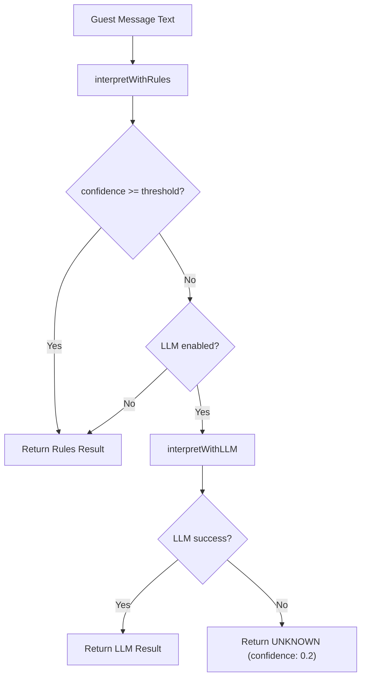
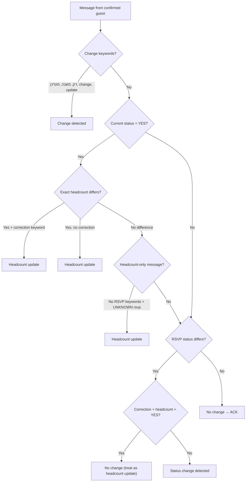
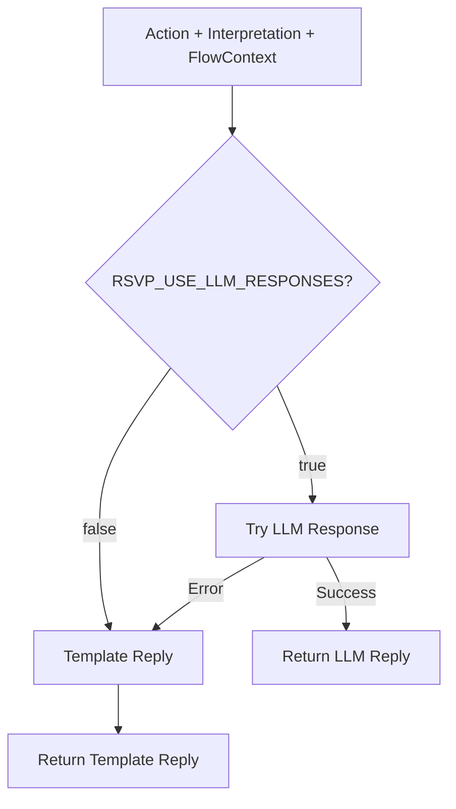
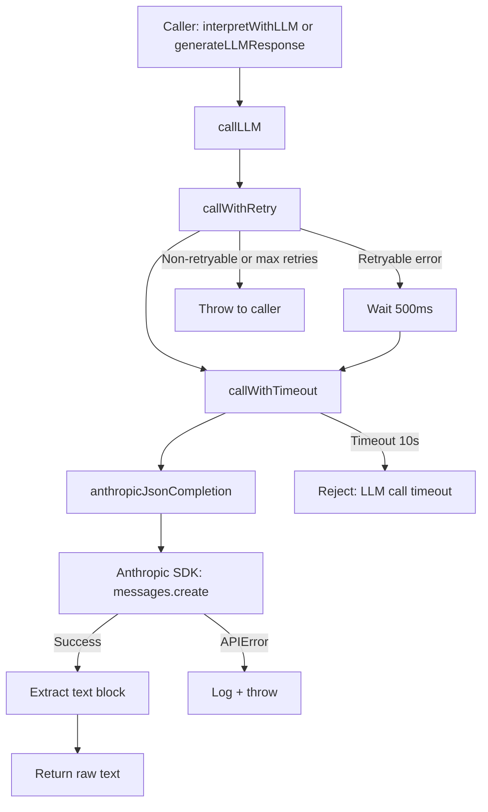

# NLU/NLG Pipeline — Natural Language Understanding & Generation

> Part of the [EZ-Event-BOT documentation](README.md).
> See also: [05-langgraph-agent.md](05-langgraph-agent.md) for the LangGraph state graph that orchestrates this pipeline.

This document covers the interpretation pipeline (rules-based + LLM fallback), headcount extraction, change detection algorithm, response generation, and LLM integration architecture.

---

## 4. NLU Pipeline — Message Interpretation

The interpretation pipeline transforms a free-text guest message into a structured `Interpretation` object:

```typescript
interface Interpretation {
  rsvp: 'YES' | 'NO' | 'MAYBE' | 'UNKNOWN';
  headcount: number | null;
  headcountExtraction: HeadcountExtraction;
  confidence: number; // 0.0 to 1.0
  needsHeadcount: boolean;
  language?: 'he' | 'en';
}
```

### 4.1 Pipeline Architecture



The threshold is configurable via `RSVP_CONFIDENCE_THRESHOLD` (default: **0.85**). This means:
- YES/NO matches (confidence 0.9) always bypass LLM
- MAYBE matches (confidence 0.85) pass at the default threshold
- Headcount-only (0.5) and unknown (0.3) always trigger LLM fallback

### 4.2 Rules-Based Interpreter

Source: `interpret/rules.ts` (~630 lines)

The rule-based interpreter is the **primary interpretation path**. It uses deterministic pattern matching optimized for Hebrew text.

#### 4.2.1 RSVP Intent Classification

Three keyword lists classify intent:

| Intent | Keywords (Hebrew) | Keywords (English) | Confidence |
|---|---|---|---|
| **YES** | כן, מגיע, אני בא, נכון, סבבה, בסדר, אוקיי | ok, yes, yeah | 0.9 |
| **NO** | לא, לא מגיע, לא יכול, לא נוכל | no, nope | 0.9 |
| **MAYBE** | תלוי, אולי, עוד לא סגור, לא בטוח | maybe, perhaps, possibly | 0.85 |

The algorithm scans the normalized message text for keyword presence. If multiple intents match, the first match wins (YES > NO > MAYBE in evaluation order).

If headcount is detected but no RSVP intent, the result is `UNKNOWN` with confidence 0.5.
If nothing matches, the result is `UNKNOWN` with confidence 0.3.

#### 4.2.2 Hebrew Text Normalization

Before keyword matching, the input text undergoes Hebrew-specific normalization:

**Step 1 — Lowercase and trim**

**Step 2 — Remove non-Hebrew characters** (for the Hebrew-specific pipeline path)

**Step 3 — Strip Niqqud (diacritical marks)**
Hebrew text may contain Unicode diacriticals in the range `\u0591-\u05C7`. These are vocalization marks that do not affect meaning for the purpose of keyword matching. The normalizer strips them:
```
"הַיְלָדִים" → "הילדים"
```

**Step 4 — Hebrew prefix stripping**
Hebrew attaches single-letter prefixes to words. The normalizer strips the prefixes ו (and), ה (the), ב (in), ל (to), כ (as), מ (from), ש (that) from tokens longer than 2 characters:
```
"והילדים" → "ילדים"    (stripped ו + ה)
"שנגיע"  → "נגיע"      (stripped ש)
```

**Step 5 — Tokenization by whitespace**

#### 4.2.3 Language Detection

A simple heuristic determines message language by counting Hebrew Unicode characters (range `\u0590-\u05FF`). If the ratio of Hebrew characters to total alphabetic characters exceeds a threshold, the message is classified as Hebrew; otherwise English.

#### 4.2.4 Headcount Extraction Algorithm

The `extractHeadcount()` function implements a **14-step priority chain** that classifies the headcount signal in the message. Each step either returns a definitive result or falls through to the next:

```
Priority  Pattern                         Result
──────────────────────────────────────────────────────────────
  1       Range/approximation             → ambiguous:RANGE_OR_APPROX
          ("2-3", "בערך 3", "כ-3")

  2       Family terms without number     → ambiguous:FAMILY_TERM
          ("ילדים", "משפחה", "kids")

  3       Direct digit extraction         → exact:N  (or ambiguous:UNKNOWN
          ("אנחנו 4", "3 people")           if contradictory digits)

  4       Hebrew number words             → exact:N  (with fuzzy flag
          ("שניים", "ארבע", "שלושה")        if Levenshtein-matched)

  5       "זוג" / "couple" / "pair"       → exact:2

  6       "רק אני" / "just me"            → exact:1

  7       Spouse patterns                  → exact:2
          ("אני ואשתי", "me and my wife")

  8       Singular child                   → exact:2 or ambiguous:FAMILY_TERM
          ("אני והילד" → 2;
           bare "ילד" → ambiguous)

  9       "אני+1" / "me plus 1"           → exact:2

 10       "אני ועוד X" / "me and X more"  → exact:1+X

 11       "me and/with X"                  → exact:1+X

 12       "אנחנו X" / "we are X"          → exact:X

 13       "סהכ X" / "total X"             → exact:X

 14       Relational "אני וX" where        → ambiguous:RELATIONAL
          X is not a number or spouse

 --       No signal detected               → none
```

#### 4.2.5 Hebrew Number Word Recognition

The interpreter recognizes Hebrew number words from 0 to 10, including gender variants:

| Number | Masculine | Feminine | Alternate Forms |
|---|---|---|---|
| 0 | אפס | — | — |
| 1 | אחד | אחת | — |
| 2 | שניים | שתיים | שני, שתי |
| 3 | שלושה | שלוש | — |
| 4 | ארבעה | ארבע | — |
| 5 | חמישה | חמש | — |
| 6 | שישה | שש | — |
| 7 | שבעה | שבע | — |
| 8 | שמונה | שמונה | — |
| 9 | תשעה | תשע | — |
| 10 | עשרה | עשר | — |

Each token in the normalized text is checked against this dictionary after prefix stripping and niqqud removal.

#### 4.2.6 Fuzzy Matching with Levenshtein Distance

For tokens that do not exactly match any number word, the interpreter optionally applies **Levenshtein distance** fuzzy matching. This handles common typos in Hebrew number words (e.g., "שנים" instead of "שניים").

**Algorithm:**
1. Only attempt fuzzy matching when `allowFuzzy` is true
2. Only consider tokens of length >= 3 (short tokens produce too many false positives)
3. Only accept matches where `levenshteinDistance(token, numberWord) <= 1`
4. If a match is found, flag the result as `fuzzy: true`

**Context-word gating:** Fuzzy matches are further gated by the presence of **headcount context words** in the message. The context words are:

```
אנחנו, נהיה, מגיעים, בסוף, סהכ, כולל
```

If the message is short (<= 3 tokens) or contains any of these context words, fuzzy matches are accepted. Otherwise, fuzzy matches are rejected. This prevents a typo in an unrelated word from being misinterpreted as a headcount.

**Levenshtein distance** is computed using the standard dynamic programming algorithm (O(m×n) time and space, where m and n are string lengths). Given the short length of Hebrew number words (3-6 characters), this is negligible.

#### 4.2.7 Confidence Scoring Model

| Detection | Confidence | Rationale |
|---|---|---|
| YES keyword match | 0.9 | High confidence — explicit affirmative |
| NO keyword match | 0.9 | High confidence — explicit negative |
| MAYBE keyword match | 0.85 | Slightly lower — ambiguity is inherent |
| Headcount only (no RSVP) | 0.5 | RSVP intent unclear — likely needs LLM |
| Nothing matched | 0.3 | No signal — LLM should handle |

### 4.3 LLM Fallback Interpreter

Source: `interpret/llmInterpreter.ts`

When the rules interpreter produces confidence below the threshold, the LLM interpreter is invoked (if enabled via `RSVP_USE_LLM_INTERPRETATION` feature flag).

#### 4.3.1 Prompt Engineering

The system prompt defines a **structured JSON output schema** that mirrors the `Interpretation` TypeScript type. Key design choices:

1. **JSON-only output**: The prompt explicitly instructs "Output ONLY valid JSON. No prose, no explanations, no markdown formatting." This enables reliable programmatic parsing.

2. **Discriminated union schema**: The LLM is instructed to output `headcountExtraction` with `kind: "exact" | "ambiguous" | "none"`, matching the TypeScript type exactly.

3. **Few-shot examples**: Five examples covering common patterns:
   - Family terms without numbers ("כן, אני והילדים" → ambiguous:FAMILY_TERM)
   - Spouse patterns ("מגיע, אני ואשתי" → exact:2)
   - Compound with numbers ("Yes me and my wife and 2 kids" → exact:4)
   - Ranges ("אנחנו 2-3" → ambiguous:RANGE_OR_APPROX)
   - Solo ("רק אני" → exact:1)

4. **"Never guess" rule**: The prompt states "NEVER guess how many kids/children/family members." This aligns the LLM with the system's conservative philosophy — ambiguity triggers clarification, not estimation.

5. **Event context**: The user prompt includes `eventTitle` and `eventDate` when available, giving the LLM context about what event the guest is responding to.

#### 4.3.2 Response Validation

The LLM response undergoes multi-layer validation:

1. **JSON extraction**: First attempts `JSON.parse()` on the raw response. If that fails, applies a regex to extract the first `{...}` block (handles cases where the LLM wraps JSON in prose despite instructions).

2. **Zod schema validation**: The extracted JSON is validated against a Zod schema matching the `Interpretation` type. Invalid fields are rejected.

3. **Confidence clamping**: The `confidence` field is clamped to the range [0, 1] to prevent out-of-bounds values.

4. **Graceful degradation**: On any error (JSON parse failure, validation error, network error), the function returns `{ rsvp: 'UNKNOWN', confidence: 0.2 }`. This ensures the system never crashes due to LLM misbehavior.

#### 4.3.3 Token Budget

The LLM interpretation call is capped at **200 tokens**. Given that the expected output is a small JSON object (~100-150 tokens), this provides adequate headroom while controlling costs.

### 4.4 Headcount-Only Interpretation

Source: `interpret/headcountOnly.ts`

When the conversation is in the `YES_AWAITING_HEADCOUNT` state, the system uses a specialized interpreter that **only extracts headcount** — it does not re-evaluate RSVP intent. This is a critical design decision: if the guest responds to "how many people?" with something like "I'm not sure yet" (which could be classified as MAYBE by the full interpreter), the headcount-only interpreter treats it as an ambiguous headcount signal rather than changing the guest's RSVP to MAYBE.

**Algorithm:**
1. Run `extractHeadcount(text, allowFuzzy=true)` — fuzzy matching is enabled here because the context is unambiguous (we are asking for a number)
2. If the result is `exact`, return immediately
3. If LLM is enabled, call the LLM with a **headcount-only prompt** (100 token budget, reduced scope)
4. Validate the LLM response with a Zod discriminated union schema
5. On any error, fall back to the rules result

---

## 5. HeadcountExtraction — A Discriminated Union Approach

### 5.1 Type Definition

```typescript
type HeadcountExtraction =
  | { kind: 'exact'; headcount: number; fuzzy?: boolean }
  | { kind: 'ambiguous'; reason: AmbiguityReason }
  | { kind: 'none' };

type AmbiguityReason = 'FAMILY_TERM' | 'RELATIONAL' | 'RANGE_OR_APPROX' | 'UNKNOWN';
```

### 5.2 Why a Discriminated Union

A naive approach would represent headcount as `number | null`, where `null` means "not mentioned." This loses critical information:

| Message | `number \| null` | `HeadcountExtraction` |
|---|---|---|
| "כן מגיע" (Yes, coming) | `null` | `{ kind: 'none' }` |
| "אני והילדים" (Me and the kids) | `null` | `{ kind: 'ambiguous', reason: 'FAMILY_TERM' }` |
| "בערך 3" (About 3) | `3`? `null`? | `{ kind: 'ambiguous', reason: 'RANGE_OR_APPROX' }` |
| "אנחנו שניים" (We are two) | `2` | `{ kind: 'exact', headcount: 2 }` |
| "שנים" (typo for שניים) | `2`? | `{ kind: 'exact', headcount: 2, fuzzy: true }` |

The discriminated union enables:
- **Adaptive clarification**: Different questions for family terms vs. ranges vs. relational phrases
- **Fuzzy confirmation**: When `fuzzy: true`, the bot can ask "Just to confirm, 2 people total?" before recording
- **No false precision**: Ranges and approximations are never silently converted to exact numbers

### 5.3 Ambiguity Reasons

| Reason | Trigger | Clarification Strategy |
|---|---|---|
| `FAMILY_TERM` | "ילדים" (kids), "משפחה" (family) without a number | "How many kids are coming? How many total?" |
| `RELATIONAL` | "אני וX" where X is a person, not a number | "Just to confirm, how many total?" |
| `RANGE_OR_APPROX` | "2-3", "בערך 3", "כ-3" | "Got it, it's approximate. Record an estimate?" |
| `UNKNOWN` | Contradictory numbers, unrecognizable patterns | "Just to make sure, how many total?" |

---

## 6. Change Detection Algorithm

Source: `domain/rsvp-graph/nodes/decideAction.ts`, function `detectChangeIntent()`

When a guest who already has a confirmed RSVP (YES or NO) sends a new message, the system must determine whether the guest intends to **update** their response or is simply **reaffirming** it. The `decideAction` node calls `detectChangeIntent()` internally — if no change is detected, it returns `ACK_NO_CHANGE` (which produces a patch containing only `lastResponseAt`). The change detection algorithm uses a **multi-signal approach**:

### 6.1 Signal Hierarchy



### 6.2 Keyword Sets

**Change keywords** (explicit update intent):
```
רק, משנה, מעדכן, מעדכנת, change, update, changing, updating
```

**Correction keywords** (mistake/correction intent):
```
טעיתי, טעות, אופס, שגיאה, תיקנתי, מתקן, mistake, error, oops, correct, correction, fix, fixed
```

### 6.3 Priority Rule: Correction + Headcount Overrides Status Change

A critical edge case: a guest with `rsvpStatus: YES, headcount: 4` sends "אופס טעיתי, נהיה 2" ("Oops, I made a mistake, we'll be 2"). The rule-based interpreter might classify this as NO (due to "mistake" context) with headcount 2.

Without the priority rule, this would be treated as a status change from YES to NO. With the rule, the system detects:
1. Correction keyword present ("טעיתי")
2. Current status is YES
3. Exact headcount differs from current (2 ≠ 4)

The algorithm prioritizes the **headcount update** interpretation, maintaining the YES status and updating the headcount to 2. This prevents accidental cancellations.

---

## 7. NLG Pipeline — Response Generation

### 7.1 Response Composition Architecture



### 7.2 Template-Based Responses (Default)

Source: `respond/templates.ts`

The default response mode uses static Hebrew templates with guest name interpolation:

| Action | Template (Hebrew) | Translation |
|---|---|---|
| `SET_RSVP` (YES + headcount) | `"תודה {name}! נרשמת {N} אנשים."` | Thanks {name}! Registered {N} people. |
| `ASK_HEADCOUNT` | `"{name}, כמה אנשים יגיעו?"` | {name}, how many people are coming? |
| `SET_RSVP` (NO) | `"תודה {name}, נשמח לראות אותך בפעם הבאה."` | Thanks {name}, hope to see you next time. |
| `SET_RSVP` (MAYBE) | `"הבנתי, תודה. תעדכן אותי כשיהיה ברור."` | Got it, thanks. Update me when it's clear. |
| `CLARIFY` | `"{name}, אנא ענה כן/לא/אולי."` | {name}, please answer yes/no/maybe. |
| `ACK` (YES + headcount) | `"תודה {name}! כבר נרשמת {N} אנשים."` | Thanks {name}! Already registered {N} people. |
| `ACK` (YES, no headcount) | `"תודה {name}! כבר נרשמת."` | Thanks {name}! Already registered. |
| `ACK` (NO) | `"תודה {name}, הבנתי שלא תוכל להגיע."` | Thanks {name}, understood you can't make it. |

Templates are deterministic, fast (no network call), and consistent. They serve as both the primary response mode and the fallback when LLM response generation fails.

### 7.3 Adaptive Clarification Questions

Source: `clarificationQuestions.ts`

When the bot needs to ask for headcount, it generates **context-aware clarification questions** that adapt based on:
1. **Ambiguity reason** — different wording for family terms vs. relational phrases vs. ranges
2. **Attempt number** — progressive simplification across up to 3 attempts
3. **Language** — Hebrew or English
4. **Guest name** — personalization

**Attempt progression:**

| Attempt | Strategy | Hebrew Example |
|---|---|---|
| 1 | Reason-specific question | `FAMILY_TERM`: "מעולה! כמה ילדים יגיעו איתך? כלומר כמה תהיו סהכ?" |
| 2 | Simplified, with example | "כדי לרשום נכון, אפשר מספר בלבד? למשל: 3" |
| 3 | Graceful exit | "אין בעיה, אשאיר כרגע בלי מספר. תמיד אפשר לעדכן בהמשך." |

The 3-attempt maximum follows a UX principle: **do not insist**. After 3 failed attempts, the bot records `headcount: null` and allows the guest to update later. This prevents frustrating loops where the guest feels interrogated.

### 7.4 LLM-Powered Responses (Optional)

Source: `respond/llmResponder.ts`, `respond/prompts/respond.prompt.ts`

When enabled via `RSVP_USE_LLM_RESPONSES=true`, the system uses Claude to generate natural Hebrew replies. The prompt constrains the output to:
- Maximum 2 short sentences
- At most 1 emoji (optional)
- Hebrew language
- JSON format: `{ "reply": "..." }`
- No invented event details

The user prompt includes: guest name, interpretation result, action type, event title/date, and headcount (if available). This gives the LLM full context to generate a contextually appropriate reply.

**Token budget**: 120 tokens (sufficient for 2 short Hebrew sentences).

**Fallback**: On any error (parse failure, timeout, validation error), the system falls back to template responses. This ensures the guest always receives a reply, even if the LLM is unavailable.

---

## 8. LLM Integration Architecture

### 8.1 Model Selection

| Property | Value | Rationale |
|---|---|---|
| **Provider** | Anthropic | Official SDK, structured output support |
| **Model** | `claude-3-haiku-20240307` | Optimized for classification tasks: low latency (~200-500ms), low cost, sufficient intelligence for RSVP parsing |
| **Temperature** | 0.2 | Low temperature for deterministic classification; slight randomness for natural response generation |

Claude 3 Haiku was chosen over larger models (Sonnet, Opus) because the task is **classification, not generation**. The input is a short Hebrew sentence, and the output is a small JSON object. Haiku provides sufficient capability at a fraction of the cost and latency.

### 8.2 Client Architecture



### 8.3 Resilience Layer

Source: `infra/llm/llmClient.ts`

| Mechanism | Configuration | Purpose |
|---|---|---|
| **Timeout** | 10 seconds | Prevents indefinite hangs; implemented via `Promise.race` |
| **Retries** | 1 retry (2 total attempts) | Handles transient network issues |
| **Retry delay** | 500ms fixed backoff | Simple delay between attempts |
| **Retryable errors** | Messages containing "timeout", "network", or "fetch" | Only retries transient failures |
| **Non-retryable** | API errors (401, 429, 400), validation errors | Fails immediately — no point retrying |

### 8.4 Token Budgets

| Use Case | Max Tokens | Typical Output Size |
|---|---|---|
| RSVP interpretation | 200 | ~100-150 tokens (JSON with all fields) |
| Response generation | 120 | ~50-80 tokens (2 Hebrew sentences) |
| Headcount-only extraction | 100 | ~50-70 tokens (small JSON) |

Token budgets are deliberately tight to control costs. If the LLM exceeds the budget, the response is truncated, which typically causes JSON parse failure — caught by the validation layer and handled via fallback.

### 8.5 JSON Extraction Strategy

LLM output parsing follows a defensive multi-step approach:

1. **Direct parse**: `JSON.parse(response)` — succeeds when the LLM outputs clean JSON
2. **Regex extraction**: If direct parse fails, extract the first `{...}` block via regex — handles cases where the LLM wraps JSON in prose (e.g., "Here's the classification: {...}")
3. **Zod validation**: The extracted object is validated against a strict Zod schema matching the expected TypeScript type
4. **Fallback**: On any failure, return a safe default (`UNKNOWN` with low confidence for interpretation, or throw for response generation which falls back to templates)
