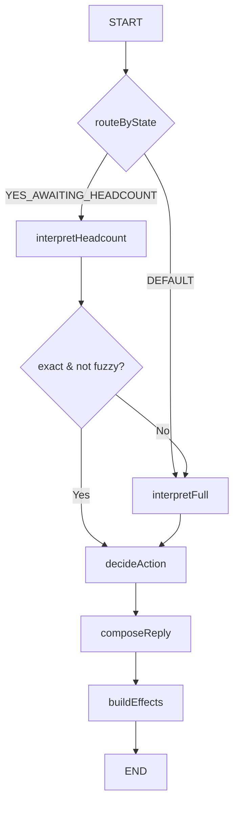
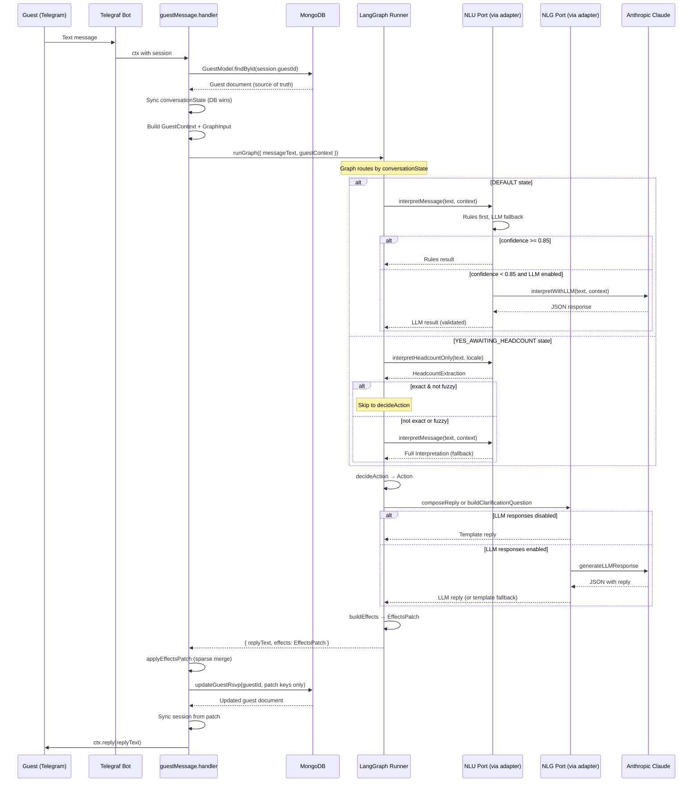

# LangGraph RSVP Agent — State Graph Architecture

> Part of the [EZ-Event-BOT documentation](README.md).
> See also: [04-nlu-pipeline.md](04-nlu-pipeline.md) for the NLU/NLG pipeline invoked by graph nodes, [03-rsvp-lifecycle.md](03-rsvp-lifecycle.md) for business logic details.

This document covers the LangGraph state graph implementation: graph topology, state annotation, node descriptions, routing, action types, EffectsPatch, port interfaces, policy rules (decideAction), session management, configuration, and design principles.

---

## 3. RSVP Agent — LangGraph State Graph

### 3.1 From FSM to LangGraph

The RSVP logic is implemented as a **LangGraph state graph** — a directed graph where each node is a pure(ish) function that reads from and writes to a shared annotation-based state. This replaces the previous procedural FSM in `rsvpFlow.ts`.

**Why LangGraph over a plain FSM:**
- **Separation of concerns**: Each node has a single responsibility (NLU, policy, NLG, effects). The procedural FSM mixed all of these.
- **Testability**: The `decideAction` node is a pure function exported separately for unit testing. Port interfaces make every external dependency mockable.
- **Observability**: LangGraph provides built-in tracing of state transitions across nodes.
- **Extensibility**: Adding new nodes (e.g., sentiment analysis, multi-turn memory) is additive — no rewiring of existing logic.

### 3.2 Graph Topology



**Routing functions:**

| Router | Input | Logic |
|---|---|---|
| `routeByState` | `state.guestContext.conversationState` | Returns `'DEFAULT'` or `'YES_AWAITING_HEADCOUNT'` |
| `headcountResultRouter` | `state.headcountExtraction` | If `kind === 'exact' && !fuzzy` → skip to `decideAction`; otherwise fall through to `interpretFull` for full NLU |

The headcount fallback path ensures that when the guest is in `YES_AWAITING_HEADCOUNT` and sends something that isn't a clear number (e.g., "actually no", "maybe"), the message goes through full NLU so intent changes are captured.

### 3.3 State Annotation

The graph state is defined as a LangGraph `Annotation` with 7 channels (all last-writer-wins, no reducers):

```typescript
RsvpAnnotation = Annotation.Root({
  messageText:         Annotation<string>,
  guestContext:        Annotation<GuestContext>,
  interpretation:      Annotation<Interpretation | null>,
  headcountExtraction: Annotation<HeadcountExtraction | null>,
  action:              Annotation<Action | null>,
  replyText:           Annotation<string>,
  effects:             Annotation<EffectsPatch | null>,
});
```

### 3.4 Node Descriptions

Each node is a **factory function** that takes `RsvpGraphPorts` and returns the LangGraph node function `(state) => partialState`.

| Node | Reads | Writes | Responsibility |
|---|---|---|---|
| `interpretFull` | `messageText`, `guestContext` | `interpretation` | Calls `ports.nlu.interpretMessage()`. No business logic. |
| `interpretHeadcount` | `messageText`, `guestContext.locale` | `headcountExtraction` | Calls `ports.nlu.interpretHeadcountOnly()`. No business logic. |
| `decideAction` | `guestContext`, `interpretation`, `headcountExtraction`, `messageText` | `action` | **All business logic** — change detection, policy rules, clarification limits. Pure function. |
| `composeReply` | `action`, `guestContext`, `interpretation` | `replyText` | Switches on `action.type`, delegates to `ports.nlg` or inline text for `STOP_WAITING_FOR_HEADCOUNT`. |
| `buildEffects` | `action`, `guestContext` | `effects` | Pure mapping to sparse `EffectsPatch`. Uses `ports.clock.now()` instead of `new Date()`. |

### 3.5 Action Types

The `decideAction` node produces one of **six action types**, modeled as a strict discriminated union:

```typescript
type Action =
  | { type: 'SET_RSVP'; rsvpStatus: RsvpStatus; headcount: number | null }
  | { type: 'ASK_HEADCOUNT' }
  | { type: 'CLARIFY_HEADCOUNT'; reason: AmbiguityReason | null; attemptNumber: number }
  | { type: 'CLARIFY_INTENT' }
  | { type: 'ACK_NO_CHANGE' }
  | { type: 'STOP_WAITING_FOR_HEADCOUNT' };
```

| Action | Semantics | When |
|---|---|---|
| `SET_RSVP` | Final RSVP determination with optional headcount | YES/NO/MAYBE with sufficient info |
| `ASK_HEADCOUNT` | Guest confirmed YES but headcount missing | YES + no exact headcount in DEFAULT state |
| `CLARIFY_HEADCOUNT` | Re-ask for headcount with attempt tracking | In `YES_AWAITING_HEADCOUNT`, no clear number |
| `CLARIFY_INTENT` | Message unclear, ask yes/no/maybe | UNKNOWN rsvp in DEFAULT state |
| `ACK_NO_CHANGE` | Guest repeated same intent, no DB mutation | Confirmed guest, no change detected |
| `STOP_WAITING_FOR_HEADCOUNT` | 3 failed headcount attempts, give up gracefully | `clarificationAttempts >= 3` |

### 3.6 EffectsPatch — Sparse DB Updates

Instead of inline `updates` objects embedded in actions, the graph produces an `EffectsPatch` — a sparse object where only the keys that should be written are present. Absent keys mean "do not touch."

```typescript
interface EffectsPatch {
  rsvpStatus?: RsvpStatus;
  headcount?: number | null;
  conversationState?: ConversationState;
  lastResponseAt: Date;              // always set
  rsvpUpdatedAt?: Date;              // only on meaningful changes
  clarificationAttempts?: number;
  lastClarificationReason?: AmbiguityReason;
}
```

**Per-action patch shapes:**

| Action | Patch Keys Present |
|---|---|
| `SET_RSVP` | `rsvpStatus`, `headcount`, `conversationState: 'DEFAULT'`, `lastResponseAt`, `rsvpUpdatedAt` (only if status/headcount actually changed), `clarificationAttempts: 0` |
| `ASK_HEADCOUNT` | `rsvpStatus: 'YES'`, `conversationState: 'YES_AWAITING_HEADCOUNT'`, `lastResponseAt`, `rsvpUpdatedAt` (only if status changed), `clarificationAttempts: 0` |
| `CLARIFY_HEADCOUNT` | `conversationState: 'YES_AWAITING_HEADCOUNT'`, `lastResponseAt`, `clarificationAttempts`, `lastClarificationReason` |
| `CLARIFY_INTENT` | `lastResponseAt` only |
| `ACK_NO_CHANGE` | `lastResponseAt` only |
| `STOP_WAITING_FOR_HEADCOUNT` | `conversationState: 'DEFAULT'`, `lastResponseAt`, `clarificationAttempts: 0` (rsvpStatus and headcount intentionally absent) |

The handler applies the patch by iterating its keys and building a DB update object from only the keys present.

### 3.7 Port Interfaces

The graph depends on four port interfaces, with no concrete implementations in the domain layer:

```typescript
interface RsvpGraphPorts {
  nlu: NluPort;       // interpretMessage(), interpretHeadcountOnly()
  nlg: NlgPort;       // composeReply(), buildClarificationQuestion()
  clock: ClockPort;   // now() — eliminates implicit new Date()
  logger: LoggerPort; // info(), debug(), warn()
}
```

Adapters in `bot/adapters/` implement these ports by wrapping the existing bot-layer NLU and NLG functions (mapping `GuestContext` ↔ `FlowContext`, graph `Action` ↔ bot `Action`).

### 3.8 Policy Rules (decideAction)

The `decideAction` function is the **single source of all business logic**. It is a pure function (no async, no side effects) that maps `(GuestContext, Interpretation?, HeadcountExtraction?, messageText)` → `Action`.

**When `conversationState = DEFAULT`:**

1. If guest already confirmed (YES/NO) and no change detected → `ACK_NO_CHANGE`
2. Headcount-only update for YES guests (UNKNOWN rsvp + exact headcount) → `SET_RSVP { YES, headcount }`
3. `rsvp = YES` + exact headcount → `SET_RSVP { YES, headcount }`
4. `rsvp = YES` + no exact headcount → `ASK_HEADCOUNT`
5. `rsvp = NO` → `SET_RSVP { NO, null }`
6. `rsvp = MAYBE` → `SET_RSVP { MAYBE, null }`
7. `rsvp = UNKNOWN` → `CLARIFY_INTENT`

**When `conversationState = YES_AWAITING_HEADCOUNT`:**

1. `clarificationAttempts >= 3` → `STOP_WAITING_FOR_HEADCOUNT`
2. Exact non-fuzzy headcount (fast path from `interpretHeadcount`) → `SET_RSVP { YES, headcount }`
3. If `interpretation` populated (fallback path ran):
   - `rsvp = NO` → `SET_RSVP { NO, null }` (exits headcount loop)
   - `rsvp = MAYBE` → `SET_RSVP { MAYBE, null }` (exits headcount loop)
   - `rsvp = YES` + exact headcount → `SET_RSVP { YES, headcount }`
   - `rsvp = YES` + no headcount → `CLARIFY_HEADCOUNT`
   - `rsvp = UNKNOWN` → `CLARIFY_HEADCOUNT` (stay in loop, re-ask)
4. Only `headcountExtraction` available, not exact → `CLARIFY_HEADCOUNT`

### 3.9 State Persistence Strategy

| Storage | Role | Durability |
|---|---|---|
| MongoDB `Guest.conversationState` | **Source of truth** | Persistent across restarts |
| Telegraf in-memory session | Cache for current interaction | Volatile (lost on restart) |
| `EffectsPatch` | Transport between graph output and DB write | Per-request (not stored) |

On every incoming message, the handler:
1. Fetches the guest from MongoDB
2. Compares DB `conversationState` with session value
3. If they diverge, **DB wins** — the session is overwritten
4. Builds `GuestContext` from merged data
5. Invokes the graph, receives `{ replyText, effects }`
6. Applies `EffectsPatch` as a sparse merge to MongoDB
7. Syncs session fields from the patch (only keys present in the patch are synced)

### 3.10 Why Two Conversation States Still Suffice

The conversational flow has a single branching point: after a YES response, the bot may need to ask for headcount. All other RSVP intents (NO, MAYBE) are terminal. The `DEFAULT` state handles all message types, while `YES_AWAITING_HEADCOUNT` is a focused sub-flow.

Within `YES_AWAITING_HEADCOUNT`, the graph supports **fallback to full NLU** — if `interpretHeadcount` doesn't extract an exact number, `interpretFull` runs so the agent can detect intent changes like "actually no" or "maybe." This eliminates the previous limitation where guests couldn't change their RSVP status during the headcount loop.

---

## 9. Session Management and Data Flow

### 9.1 Full Message Lifecycle



### 9.2 Session Structure

```typescript
interface BotSession {
  guest?: {
    guestId: string;
    campaignId: string;
    name: string;
    phone: string;
    rsvpStatus: string;
    headcount?: number;
    conversationState?: 'DEFAULT' | 'YES_AWAITING_HEADCOUNT';
    lastResponseAt?: Date;
  };
  eventTitle?: string;
  eventDate?: string;
  headcountClarificationAttempts?: number;
  lastHeadcountClarificationReason?: AmbiguityReason;
}
```

### 9.3 Session vs. Database — Division of Responsibilities

| Data | Stored In | Rationale |
|---|---|---|
| Guest identity (name, phone, IDs) | Session + DB | Session avoids DB lookup per message for identity; DB is the persistent record |
| RSVP status, headcount | DB (source of truth) | Must survive bot restarts; session is synced after each DB write |
| conversationState | DB + Session | DB is authoritative; session is a cache that is overwritten from DB on each message |
| eventTitle, eventDate | Session only | Fetched once during `/start`; avoids repeated Campaign lookups |
| Clarification attempt count | Session only | Lightweight tracking that does not need persistence; resets naturally if session is lost |
| Clarification reason | Session only | Same rationale as attempt count |

### 9.4 Why Session Caches Campaign Data

On `/start`, the handler fetches the Campaign document to get `eventTitle` and `eventDate`, then stores them in the session. On subsequent messages, the RSVP flow accesses these from the session without making a Campaign DB query. Since event details rarely change during a conversation, this is a safe optimization that reduces MongoDB load.

---

## 10. Configuration and Feature Flags

### 10.1 LLM-Related Environment Variables

| Variable | Type | Default | Description |
|---|---|---|---|
| `ANTHROPIC_API_KEY` | `string` (optional) | — | Anthropic API key. **Required** when `RSVP_USE_LLM_INTERPRETATION=true` |
| `RSVP_USE_LLM_INTERPRETATION` | `boolean` | `true` | Enable LLM fallback for message interpretation |
| `RSVP_USE_LLM_RESPONSES` | `boolean` | `false` | Enable LLM-generated reply text |
| `RSVP_CONFIDENCE_THRESHOLD` | `number` (0-1) | `0.85` | Minimum rules confidence to skip LLM |

All environment variables are validated at startup via **Zod schemas** with transformers (string-to-boolean, string-to-number) and cross-validation:

```typescript
.refine(
  (data) => {
    if (data.RSVP_USE_LLM_INTERPRETATION && !data.ANTHROPIC_API_KEY) {
      return false;
    }
    return true;
  },
  { message: 'ANTHROPIC_API_KEY is required when RSVP_USE_LLM_INTERPRETATION is true' }
)
```

### 10.2 Operating Modes

| Mode | `RSVP_USE_LLM_INTERPRETATION` | `RSVP_USE_LLM_RESPONSES` | Behavior |
|---|---|---|---|
| **Rules-only** | `false` | `false` | Zero LLM calls. Fully deterministic. Handles common patterns only. |
| **Hybrid (default)** | `true` | `false` | LLM interprets ambiguous messages. Templates for all replies. Best cost/quality balance. |
| **Full LLM** | `true` | `true` | LLM for both interpretation and response generation. Most natural but highest cost. |

---

## 11. Design Principles and Tradeoffs

### 11.1 Rules-First, LLM-Fallback

The fundamental architectural principle. Deterministic rules handle the majority of messages — common Hebrew RSVP phrases that match clear patterns. The LLM is reserved for the **long tail** of unusual, ambiguous, or complex messages.

**Tradeoff**: Rules require maintenance (new keywords must be added manually) but provide predictable behavior. The LLM handles novel inputs but introduces latency, cost, and non-determinism.

### 11.2 Never Guess

When headcount information is ambiguous ("אני והילדים" — me and the kids), the system **never guesses** a number. Instead, it classifies the extraction as `ambiguous` with a specific reason and asks a targeted clarification question.

**Tradeoff**: Guests may need to answer a follow-up question, adding one extra message exchange. However, the data accuracy is significantly higher.

### 11.3 Conservative Confidence Thresholds

The default threshold of 0.85 ensures that only high-confidence rule matches are accepted without LLM verification. MAYBE matches (0.85) are at the boundary — any slightly unusual phrasing triggers LLM fallback.

**Tradeoff**: More LLM calls than a lower threshold, but fewer misclassifications from the rule engine.

### 11.4 Hebrew-First Design

All templates, keyword lists, and NLP normalization are designed for Hebrew as the primary language. English support exists but is secondary. The Hebrew-specific techniques (niqqud stripping, prefix removal, gender-variant number words) are tailored to the domain.

**Tradeoff**: Tightly coupled to Hebrew, requiring explicit work to add another language. The domain (Israeli events) makes Hebrew the overwhelming majority language.

### 11.5 Focused Sub-Flows with Intent-Change Fallback

In the `YES_AWAITING_HEADCOUNT` state, the graph first tries `interpretHeadcountOnly()` (a cheap, number-only extraction). If an exact non-fuzzy number is found, the fast path proceeds directly to `decideAction`. If not, the graph falls through to `interpretFull` — enabling detection of intent changes like "actually no" or "maybe."

**Tradeoff**: The fallback path adds one extra NLU call when the headcount-only extractor can't find a clear number. This is acceptable because it prevents the previous limitation where guests were locked into the headcount loop.

### 11.6 Cost Optimization

| Technique | Savings |
|---|---|
| Rules-first pipeline | ~80-90% of messages avoid LLM calls entirely |
| Haiku model | ~10x cheaper than Sonnet, ~60x cheaper than Opus |
| Tight token budgets (100-200) | Prevents runaway costs from verbose LLM outputs |
| LLM responses disabled by default | Templates are free; LLM responses are opt-in |
| Singleton client | Avoids repeated SDK initialization overhead |

### 11.7 Graceful Degradation at Every Layer

Every component that depends on the LLM has an explicit fallback:

| Component | LLM Failure Fallback |
|---|---|
| Interpretation pipeline | Returns rules result (even if low confidence) |
| LLM interpreter | Returns `UNKNOWN` with confidence 0.2 |
| Response composer | Falls back to template replies |
| Headcount-only extractor | Returns rules extraction result |

The system is designed to **always produce a reply**, even if every LLM call fails.

### 11.8 Hexagonal Architecture (Ports & Adapters)

The domain layer defines **port interfaces** for all external capabilities. Concrete implementations live in the bot layer as **adapters**.

| Port | Interface Methods | Adapter |
|---|---|---|
| `NluPort` | `interpretMessage()`, `interpretHeadcountOnly()` | `bot/adapters/nluAdapter.ts` |
| `NlgPort` | `composeReply()`, `buildClarificationQuestion()` | `bot/adapters/nlgAdapter.ts` |
| `ClockPort` | `now()` | Inline: `{ now: () => new Date() }` in handler |
| `LoggerPort` | `info()`, `debug()`, `warn()` | Pino logger instance |

**Tradeoff**: Adapters add a thin mapping layer (GuestContext ↔ FlowContext, graph Action ↔ bot Action). This is a small cost for the ability to test the domain graph in isolation with mock ports.

### 11.9 ClockPort Eliminates Implicit Time

The domain graph never calls `new Date()` directly. All timestamps come from `ClockPort.now()`. This enables:
- **Deterministic unit tests**: Tests inject a fixed clock, making assertions on `EffectsPatch.lastResponseAt` and `rsvpUpdatedAt` exact rather than approximate.
- **Future flexibility**: Clock can be replaced with a server-synced or event-sourced timestamp if needed.

### 11.10 Sparse EffectsPatch Prevents Accidental Overwrites

Actions like `ACK_NO_CHANGE` and `CLARIFY_INTENT` only need to update `lastResponseAt`. The `EffectsPatch` pattern makes this explicit: absent keys are never written to the DB. The handler iterates patch keys and only includes present ones in the MongoDB update object.

### 11.11 Architecture Boundary Enforcement

The separation between domain and bot/infra layers is enforced by grep-based checks:
- `domain/rsvp-graph/` must not import from `bot/`, `mongoose`, `telegraf`
- `domain/rsvp-graph/` must not contain `new Date()` (all via ClockPort)

These checks can be run in CI to prevent boundary violations from being merged.

---

## Appendix A: Source File Reference

**Domain Layer — Pure, no infra imports:**

| File | Role |
|---|---|
| `domain/rsvp/types.ts` | Shared domain types: `RsvpStatus`, `ConversationState`, `AmbiguityReason`, `HeadcountExtraction`, `Interpretation` |
| `domain/rsvp-graph/types.ts` | Graph-specific types: `GuestContext`, `Action` (6-variant union), `EffectsPatch`, `GraphInput`/`GraphOutput` |
| `domain/rsvp-graph/ports.ts` | Port interfaces: `NluPort`, `NlgPort`, `ClockPort`, `LoggerPort`, `RsvpGraphPorts` |
| `domain/rsvp-graph/state.ts` | LangGraph `RsvpAnnotation` — 7 state channels |
| `domain/rsvp-graph/nodes/interpretFull.ts` | Node: calls `ports.nlu.interpretMessage()`, sets `interpretation` |
| `domain/rsvp-graph/nodes/interpretHeadcount.ts` | Node: calls `ports.nlu.interpretHeadcountOnly()`, sets `headcountExtraction` |
| `domain/rsvp-graph/nodes/decideAction.ts` | Node: all business logic — change detection, policy rules, produces `Action`. Pure function exported for unit testing. |
| `domain/rsvp-graph/nodes/composeReply.ts` | Node: switches on `action.type`, delegates to NLG port |
| `domain/rsvp-graph/nodes/buildEffects.ts` | Node: pure mapping from `Action` + `GuestContext` → sparse `EffectsPatch` via `ClockPort` |
| `domain/rsvp-graph/graph.ts` | LangGraph `StateGraph` definition with conditional routing and edges |
| `domain/rsvp-graph/index.ts` | Public API: `createRsvpGraphRunner()` singleton factory |
| `domain/rsvp-graph/nodes/decideAction.test.ts` | Unit tests for `decideAction` and `buildEffects` (node:test) |

**Bot Layer — Infrastructure, adapters, Telegraf:**

| File | Role |
|---|---|
| `bot/handlers/guestMessage.handler.ts` | Message handler: DB fetch, builds GuestContext, calls graph runner, applies EffectsPatch, session sync |
| `bot/adapters/nluAdapter.ts` | Implements `NluPort` — wraps existing NLU functions, maps GuestContext → FlowContext |
| `bot/adapters/nlgAdapter.ts` | Implements `NlgPort` — wraps existing NLG functions, maps graph Action → bot Action |
| `bot/rsvp/types.ts` | Re-export shim for domain types + bot-layer `Action`, `FlowContext` |
| `bot/rsvp/interpret/index.ts` | Interpretation pipeline entry (rules → threshold → LLM) |
| `bot/rsvp/interpret/rules.ts` | Rule-based NLP: keywords, headcount extraction, Hebrew normalization, fuzzy matching |
| `bot/rsvp/interpret/headcountOnly.ts` | Focused headcount-only extractor for YES_AWAITING_HEADCOUNT state |
| `bot/rsvp/interpret/llmInterpreter.ts` | LLM interpretation with Zod validation and JSON extraction |
| `bot/rsvp/interpret/prompts/interpret.prompt.ts` | System prompt for NLU: structured JSON schema, few-shot examples, "never guess" rules |
| `bot/rsvp/respond/index.ts` | Response composition: LLM vs. templates routing |
| `bot/rsvp/respond/templates.ts` | Static Hebrew reply templates |
| `bot/rsvp/respond/llmResponder.ts` | LLM response generation with Zod validation |
| `bot/rsvp/respond/prompts/respond.prompt.ts` | System prompt for NLG: constraints (2 sentences, 1 emoji, Hebrew) |
| `bot/rsvp/clarificationQuestions.ts` | Adaptive clarification question builder (3-attempt progression) |
| `bot/rsvp/rsvpFlow.ts` | **Legacy** — retained for reference/rollback, no longer imported by handler |
| `bot/createBot.ts` | Bot creation: Telegraf instance, session middleware, handler wiring |

**Infra & Config:**

| File | Role |
|---|---|
| `infra/llm/anthropic.ts` | Anthropic SDK wrapper: singleton client, claude-3-haiku, temperature 0.2 |
| `infra/llm/llmClient.ts` | Resilience layer: 10s timeout, 1 retry, retryable error classification |
| `config/env.ts` | Zod-validated environment config with LLM feature flags |

---

## Appendix B: Glossary

| Term | Definition |
|---|---|
| **NLU** | Natural Language Understanding — extracting structured meaning from free text |
| **NLG** | Natural Language Generation — producing human-readable text from structured data |
| **LangGraph** | A library from LangChain for building stateful, graph-based agent workflows with typed state annotations |
| **State graph** | A directed graph where nodes are functions that read/write shared state, connected by edges and conditional routing |
| **Annotation** | LangGraph's mechanism for defining typed state channels with optional reducers |
| **Port** | An interface defining a capability the domain depends on (e.g., `NluPort`, `ClockPort`), without specifying implementation |
| **Adapter** | A concrete implementation of a port that wraps existing infrastructure code |
| **EffectsPatch** | A sparse object where only present keys are written to the database; absent keys are untouched |
| **FSM** | Finite State Machine — a model with discrete states and transitions |
| **Discriminated union** | A TypeScript type pattern where a shared field (e.g., `kind` or `type`) determines the shape of the rest of the object |
| **Niqqud** | Hebrew diacritical marks (vowel points) that appear above/below letters |
| **Levenshtein distance** | The minimum number of single-character edits (insert, delete, substitute) to transform one string into another |
| **Few-shot prompting** | Including examples in the LLM prompt to guide the expected output format |
| **Confidence threshold** | The minimum confidence score required to accept a classification without LLM verification |
| **Headcount context words** | Hebrew words indicating quantity context: אנחנו, נהיה, מגיעים, סהכ, כולל |
| **Deep link** | A Telegram URL that opens a bot with a pre-filled `/start` parameter (e.g., `https://t.me/bot?start=inv_token`) |
