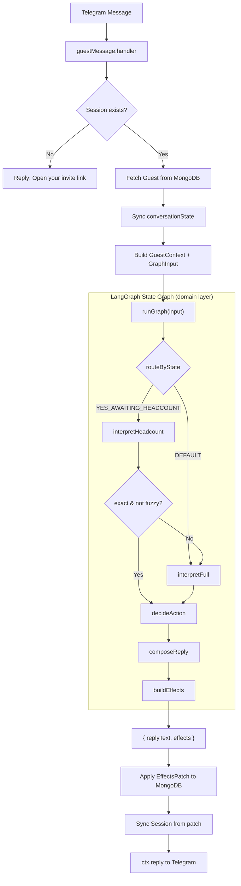
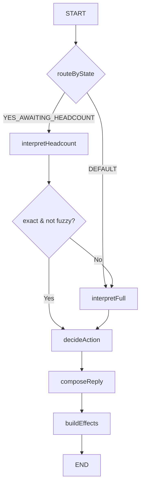
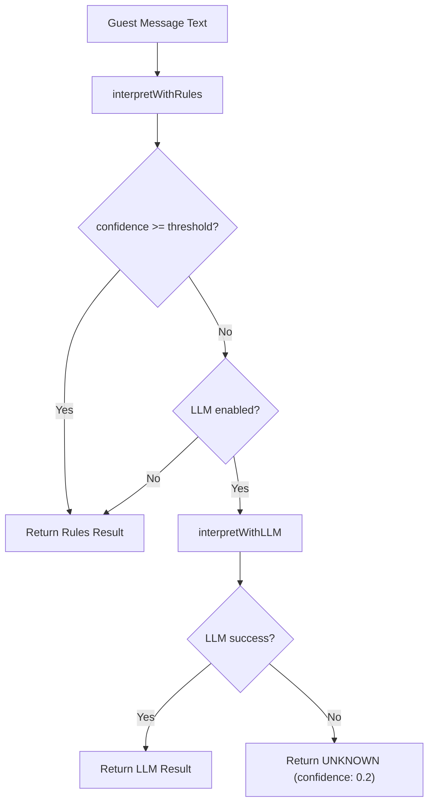
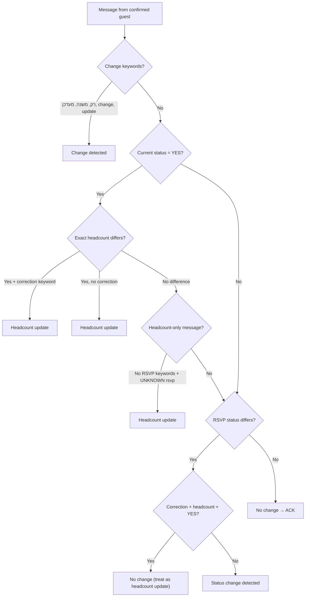
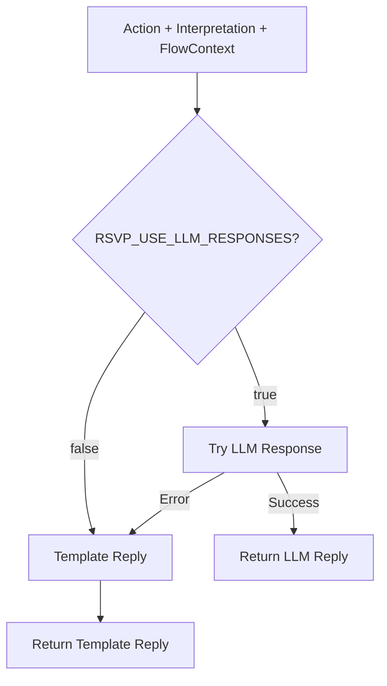
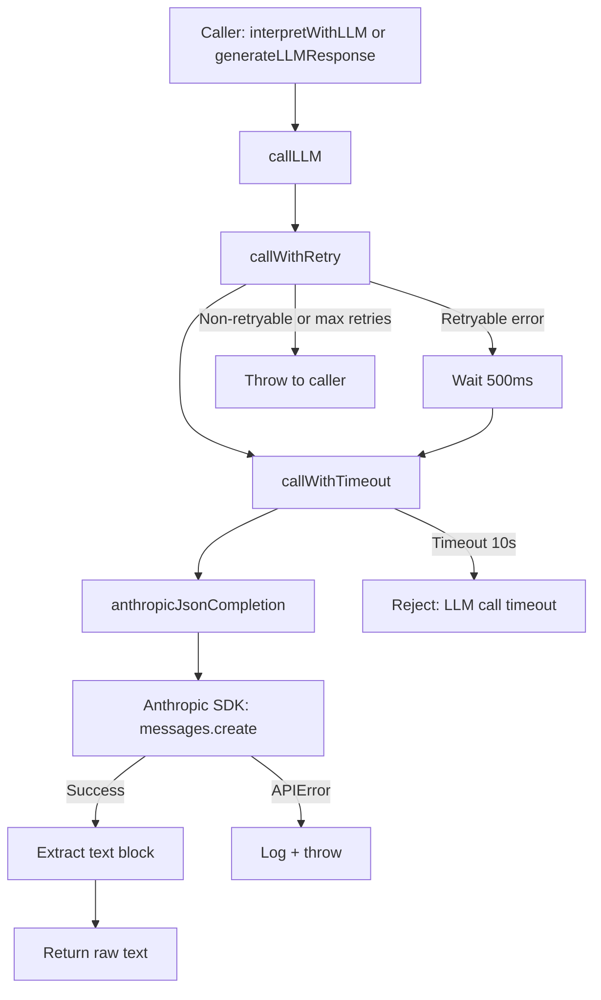
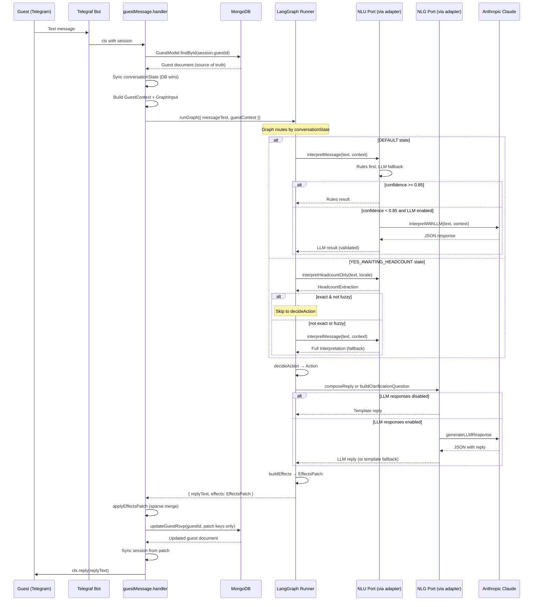

# AI Bot Architecture — RSVP Agent with Hybrid NLP/LLM Pipeline

## 1. Introduction and Problem Statement

### 1.1 Problem Domain

Event organizers need to collect RSVP responses from invited guests. Traditional methods (web forms, phone calls) suffer from low response rates and friction. This system deploys a **conversational AI agent** on Telegram that interacts with guests in natural language — primarily Hebrew — to collect and manage RSVP responses automatically.

The core challenge is **Natural Language Understanding (NLU) in Hebrew**: guests respond in free-text with colloquial expressions, abbreviations, ambiguous phrasing, and varying levels of specificity. Examples:

| Guest Message | Expected Interpretation |
|---|---|
| "כן מגיע" (Yes, coming) | RSVP: YES, headcount unknown |
| "אנחנו זוג" (We're a couple) | RSVP: YES, headcount: 2 |
| "תלוי בעבודה, עוד לא סגור" (Depends on work, not decided) | RSVP: MAYBE |
| "אני ואשתי ו-2 ילדים" (Me, my wife, and 2 kids) | RSVP: YES, headcount: 4 |
| "אופס טעיתי, נהיה 2" (Oops mistake, we'll be 2) | Headcount update to 2, keep YES |

### 1.2 Why LLM-as-Agent

A purely rule-based system handles common patterns well but fails on:
- Ambiguous or nuanced expressions ("תלוי מה יהיה" — depends on what happens)
- Mixed-language messages (Hebrew + English)
- Complex compound sentences ("כן מגיע אבל אולי גם הילדים, עוד לא סגור")
- Uncommon phrasings that fall outside keyword dictionaries

A purely LLM-based system introduces:
- **Latency**: API round-trips add 500ms-2s per message
- **Cost**: Per-token pricing accumulates across many guests
- **Non-determinism**: Identical inputs may produce different classifications
- **Reliability**: Network failures, rate limits, and API downtime

### 1.3 The Hybrid Approach

This system implements a **rules-first, LLM-fallback** architecture:

1. Every message is first processed by a **deterministic rule-based interpreter** with Hebrew-specific NLP
2. If the rule engine produces a result with **confidence >= threshold** (default 0.85), the result is accepted immediately — no LLM call
3. Only when rules are insufficient (low confidence) does the system **fall back to an LLM** (Anthropic Claude) for classification
4. Response generation follows the same pattern: **templates by default**, with optional LLM-powered replies behind a feature flag

This yields deterministic behavior for ~80-90% of messages (common RSVP patterns), with LLM handling the long tail of ambiguous cases.

---

## 2. System Architecture Overview

### 2.1 High-Level Pipeline

The RSVP pipeline is implemented as a **LangGraph state graph** wrapped in a hexagonal (ports & adapters) architecture. The handler builds a `GraphInput`, invokes the compiled graph, and applies the returned `EffectsPatch` to the database.



### 2.1.1 Layered Architecture

The codebase enforces strict import boundaries between three layers:

```
┌──────────────────────────────────────────────────────────────┐
│  bot/handlers/           │  bot/adapters/                    │
│  (Telegraf, session,     │  (nluAdapter, nlgAdapter          │
│   MongoDB persistence)   │   — bridge bot→domain)            │
│  Imports: telegraf,      │  Imports: bot/rsvp/interpret/*,   │
│   mongoose, domain/*     │   bot/rsvp/respond/*              │
├──────────────────────────┴───────────────────────────────────┤
│  domain/rsvp-graph/          │  domain/rsvp/                 │
│  (LangGraph state graph,     │  (shared types:               │
│   nodes, ports, effects)     │   RsvpStatus, Interpretation, │
│  Imports: @langchain/        │   HeadcountExtraction, etc.)  │
│   langgraph, domain/rsvp/*   │  Imports: nothing             │
│  NO: bot/*, mongoose,        │                               │
│   telegraf, new Date()       │                               │
└──────────────────────────────┴───────────────────────────────┘
```

**Boundary rules** (verified by grep in CI):
- `domain/rsvp-graph/` never imports from `bot/`, `mongoose`, `telegraf`, or calls `new Date()`
- All external capabilities are accessed through **port interfaces** (`NluPort`, `NlgPort`, `ClockPort`, `LoggerPort`)
- Infra adapters implement ports by wrapping existing bot-layer functions

### 2.2 Component Inventory

**Domain Layer** (pure, no infra imports):

| Component | Source File | Responsibility |
|---|---|---|
| Shared Domain Types | `domain/rsvp/types.ts` | `RsvpStatus`, `ConversationState`, `HeadcountExtraction`, `Interpretation`, `AmbiguityReason` |
| Graph Types | `domain/rsvp-graph/types.ts` | `GuestContext`, `Action` (6-variant union), `EffectsPatch`, `GraphInput`/`GraphOutput` |
| Port Interfaces | `domain/rsvp-graph/ports.ts` | `NluPort`, `NlgPort`, `ClockPort`, `LoggerPort`, `RsvpGraphPorts` |
| State Annotation | `domain/rsvp-graph/state.ts` | LangGraph `RsvpAnnotation` — 7-channel state definition |
| interpretFull Node | `domain/rsvp-graph/nodes/interpretFull.ts` | NLU only — calls `ports.nlu.interpretMessage()`, sets `interpretation` on state |
| interpretHeadcount Node | `domain/rsvp-graph/nodes/interpretHeadcount.ts` | Calls `ports.nlu.interpretHeadcountOnly()`, sets `headcountExtraction` on state |
| decideAction Node | `domain/rsvp-graph/nodes/decideAction.ts` | **All business logic**: change detection, policy rules, produces `Action` |
| composeReply Node | `domain/rsvp-graph/nodes/composeReply.ts` | Switches on `action.type`, delegates to NLG port or inline text |
| buildEffects Node | `domain/rsvp-graph/nodes/buildEffects.ts` | Pure mapping from `Action` + `GuestContext` → sparse `EffectsPatch` via `ClockPort` |
| Graph Definition | `domain/rsvp-graph/graph.ts` | LangGraph `StateGraph` with conditional routing, compiled once |
| Graph Runner | `domain/rsvp-graph/index.ts` | `createRsvpGraphRunner()` — singleton factory returning `(GraphInput) => Promise<GraphOutput>` |

**Bot Layer** (infrastructure, adapters, Telegraf):

| Component | Source File | Responsibility |
|---|---|---|
| Message Handler | `bot/handlers/guestMessage.handler.ts` | Session check, DB fetch, builds `GuestContext`, calls graph runner, applies `EffectsPatch`, sends reply |
| NLU Adapter | `bot/adapters/nluAdapter.ts` | Implements `NluPort` — wraps existing `interpretMessage()` and `interpretHeadcountOnly()` |
| NLG Adapter | `bot/adapters/nlgAdapter.ts` | Implements `NlgPort` — wraps existing `composeReply()` and `buildHeadcountClarificationQuestion()` |
| Bot Types (shim) | `bot/rsvp/types.ts` | Re-exports domain types + defines bot-layer `Action`, `FlowContext` |
| Rule-Based Interpreter | `bot/rsvp/interpret/rules.ts` | Deterministic Hebrew/English NLP with keyword matching and headcount extraction |
| LLM Interpreter | `bot/rsvp/interpret/llmInterpreter.ts` | Anthropic Claude fallback for ambiguous messages |
| Interpretation Pipeline | `bot/rsvp/interpret/index.ts` | Routes between rules and LLM based on confidence threshold |
| Headcount-Only Extractor | `bot/rsvp/interpret/headcountOnly.ts` | Focused extraction for YES_AWAITING_HEADCOUNT state |
| Response Composer | `bot/rsvp/respond/index.ts` | Routes between templates and LLM responses |
| Template Engine | `bot/rsvp/respond/templates.ts` | Static Hebrew reply templates |
| LLM Responder | `bot/rsvp/respond/llmResponder.ts` | LLM-generated natural replies |
| Clarification Builder | `bot/rsvp/clarificationQuestions.ts` | Adaptive headcount clarification questions |
| Legacy State Machine | `bot/rsvp/rsvpFlow.ts` | **Retained for reference/rollback** — no longer imported by handler |

**Infra Layer**:

| Component | Source File | Responsibility |
|---|---|---|
| Anthropic Client | `infra/llm/anthropic.ts` | Anthropic SDK wrapper (singleton) |
| LLM Client | `infra/llm/llmClient.ts` | Timeout, retry, and error handling layer |

---

## 3. RSVP Agent — LangGraph State Graph

### 3.1 From FSM to LangGraph

The RSVP logic is implemented as a **LangGraph state graph** — a directed graph where each node is a pure(ish) function that reads from and writes to a shared annotation-based state. This replaces the previous procedural FSM in `rsvpFlow.ts`.

**Why LangGraph over a plain FSM:**
- **Separation of concerns**: Each node has a single responsibility (NLU, policy, NLG, effects). The procedural FSM mixed all of these.
- **Testability**: The `decideAction` node is a pure function exported separately for unit testing. Port interfaces make every external dependency mockable.
- **Observability**: LangGraph provides built-in tracing of state transitions across nodes.
- **Extensibility**: Adding new nodes (e.g., sentiment analysis, multi-turn memory) is additive — no rewiring of existing logic.

### 3.2 Graph Topology



**Routing functions:**

| Router | Input | Logic |
|---|---|---|
| `routeByState` | `state.guestContext.conversationState` | Returns `'DEFAULT'` or `'YES_AWAITING_HEADCOUNT'` |
| `headcountResultRouter` | `state.headcountExtraction` | If `kind === 'exact' && !fuzzy` → skip to `decideAction`; otherwise fall through to `interpretFull` for full NLU |

The headcount fallback path ensures that when the guest is in `YES_AWAITING_HEADCOUNT` and sends something that isn't a clear number (e.g., "actually no", "maybe"), the message goes through full NLU so intent changes are captured.

### 3.3 State Annotation

The graph state is defined as a LangGraph `Annotation` with 7 channels (all last-writer-wins, no reducers):

```typescript
RsvpAnnotation = Annotation.Root({
  messageText:        Annotation<string>,
  guestContext:       Annotation<GuestContext>,
  interpretation:     Annotation<Interpretation | null>,
  headcountExtraction: Annotation<HeadcountExtraction | null>,
  action:             Annotation<Action | null>,
  replyText:          Annotation<string>,
  effects:            Annotation<EffectsPatch | null>,
});
```

### 3.4 Node Descriptions

Each node is a **factory function** that takes `RsvpGraphPorts` and returns the LangGraph node function `(state) => partialState`.

| Node | Reads | Writes | Responsibility |
|---|---|---|---|
| `interpretFull` | `messageText`, `guestContext` | `interpretation` | Calls `ports.nlu.interpretMessage()`. No business logic. |
| `interpretHeadcount` | `messageText`, `guestContext.locale` | `headcountExtraction` | Calls `ports.nlu.interpretHeadcountOnly()`. No business logic. |
| `decideAction` | `guestContext`, `interpretation`, `headcountExtraction`, `messageText` | `action` | **All business logic** — change detection, policy rules, clarification limits. Pure function. |
| `composeReply` | `action`, `guestContext`, `interpretation` | `replyText` | Switches on `action.type`, delegates to `ports.nlg` or inline text for `STOP_WAITING_FOR_HEADCOUNT`. |
| `buildEffects` | `action`, `guestContext` | `effects` | Pure mapping to sparse `EffectsPatch`. Uses `ports.clock.now()` instead of `new Date()`. |

### 3.5 Action Types

The `decideAction` node produces one of **six action types**, modeled as a strict discriminated union:

```typescript
type Action =
  | { type: 'SET_RSVP'; rsvpStatus: RsvpStatus; headcount: number | null }
  | { type: 'ASK_HEADCOUNT' }
  | { type: 'CLARIFY_HEADCOUNT'; reason: AmbiguityReason | null; attemptNumber: number }
  | { type: 'CLARIFY_INTENT' }
  | { type: 'ACK_NO_CHANGE' }
  | { type: 'STOP_WAITING_FOR_HEADCOUNT' };
```

| Action | Semantics | When |
|---|---|---|
| `SET_RSVP` | Final RSVP determination with optional headcount | YES/NO/MAYBE with sufficient info |
| `ASK_HEADCOUNT` | Guest confirmed YES but headcount missing | YES + no exact headcount in DEFAULT state |
| `CLARIFY_HEADCOUNT` | Re-ask for headcount with attempt tracking | In `YES_AWAITING_HEADCOUNT`, no clear number |
| `CLARIFY_INTENT` | Message unclear, ask yes/no/maybe | UNKNOWN rsvp in DEFAULT state |
| `ACK_NO_CHANGE` | Guest repeated same intent, no DB mutation | Confirmed guest, no change detected |
| `STOP_WAITING_FOR_HEADCOUNT` | 3 failed headcount attempts, give up gracefully | `clarificationAttempts >= 3` |

### 3.6 EffectsPatch — Sparse DB Updates

Instead of inline `updates` objects embedded in actions, the graph produces an `EffectsPatch` — a sparse object where only the keys that should be written are present. Absent keys mean "do not touch."

```typescript
interface EffectsPatch {
  rsvpStatus?: RsvpStatus;
  headcount?: number | null;
  conversationState?: ConversationState;
  lastResponseAt: Date;              // always set
  rsvpUpdatedAt?: Date;              // only on meaningful changes
  clarificationAttempts?: number;
  lastClarificationReason?: AmbiguityReason;
}
```

**Per-action patch shapes:**

| Action | Patch Keys Present |
|---|---|
| `SET_RSVP` | `rsvpStatus`, `headcount`, `conversationState: 'DEFAULT'`, `lastResponseAt`, `rsvpUpdatedAt` (only if status/headcount actually changed), `clarificationAttempts: 0` |
| `ASK_HEADCOUNT` | `rsvpStatus: 'YES'`, `conversationState: 'YES_AWAITING_HEADCOUNT'`, `lastResponseAt`, `rsvpUpdatedAt` (only if status changed), `clarificationAttempts: 0` |
| `CLARIFY_HEADCOUNT` | `conversationState: 'YES_AWAITING_HEADCOUNT'`, `lastResponseAt`, `clarificationAttempts`, `lastClarificationReason` |
| `CLARIFY_INTENT` | `lastResponseAt` only |
| `ACK_NO_CHANGE` | `lastResponseAt` only |
| `STOP_WAITING_FOR_HEADCOUNT` | `conversationState: 'DEFAULT'`, `lastResponseAt`, `clarificationAttempts: 0` (rsvpStatus and headcount intentionally absent) |

The handler applies the patch by iterating its keys and building a DB update object from only the keys present.

### 3.7 Port Interfaces

The graph depends on four port interfaces, with no concrete implementations in the domain layer:

```typescript
interface RsvpGraphPorts {
  nlu: NluPort;      // interpretMessage(), interpretHeadcountOnly()
  nlg: NlgPort;      // composeReply(), buildClarificationQuestion()
  clock: ClockPort;  // now() — eliminates implicit new Date()
  logger: LoggerPort; // info(), debug(), warn()
}
```

Adapters in `bot/adapters/` implement these ports by wrapping the existing bot-layer NLU and NLG functions (mapping `GuestContext` ↔ `FlowContext`, graph `Action` ↔ bot `Action`).

### 3.8 Policy Rules (decideAction)

The `decideAction` function is the **single source of all business logic**. It is a pure function (no async, no side effects) that maps `(GuestContext, Interpretation?, HeadcountExtraction?, messageText)` → `Action`.

**When `conversationState = DEFAULT`:**

1. If guest already confirmed (YES/NO) and no change detected → `ACK_NO_CHANGE`
2. Headcount-only update for YES guests (UNKNOWN rsvp + exact headcount) → `SET_RSVP { YES, headcount }`
3. `rsvp = YES` + exact headcount → `SET_RSVP { YES, headcount }`
4. `rsvp = YES` + no exact headcount → `ASK_HEADCOUNT`
5. `rsvp = NO` → `SET_RSVP { NO, null }`
6. `rsvp = MAYBE` → `SET_RSVP { MAYBE, null }`
7. `rsvp = UNKNOWN` → `CLARIFY_INTENT`

**When `conversationState = YES_AWAITING_HEADCOUNT`:**

1. `clarificationAttempts >= 3` → `STOP_WAITING_FOR_HEADCOUNT`
2. Exact non-fuzzy headcount (fast path from `interpretHeadcount`) → `SET_RSVP { YES, headcount }`
3. If `interpretation` populated (fallback path ran):
   - `rsvp = NO` → `SET_RSVP { NO, null }` (exits headcount loop)
   - `rsvp = MAYBE` → `SET_RSVP { MAYBE, null }` (exits headcount loop)
   - `rsvp = YES` + exact headcount → `SET_RSVP { YES, headcount }`
   - `rsvp = YES` + no headcount → `CLARIFY_HEADCOUNT`
   - `rsvp = UNKNOWN` → `CLARIFY_HEADCOUNT` (stay in loop, re-ask)
4. Only `headcountExtraction` available, not exact → `CLARIFY_HEADCOUNT`

### 3.9 State Persistence Strategy

| Storage | Role | Durability |
|---|---|---|
| MongoDB `Guest.conversationState` | **Source of truth** | Persistent across restarts |
| Telegraf in-memory session | Cache for current interaction | Volatile (lost on restart) |
| `EffectsPatch` | Transport between graph output and DB write | Per-request (not stored) |

On every incoming message, the handler:
1. Fetches the guest from MongoDB
2. Compares DB `conversationState` with session value
3. If they diverge, **DB wins** — the session is overwritten
4. Builds `GuestContext` from merged data
5. Invokes the graph, receives `{ replyText, effects }`
6. Applies `EffectsPatch` as a sparse merge to MongoDB
7. Syncs session fields from the patch (only keys present in the patch are synced)

### 3.10 Why Two Conversation States Still Suffice

The conversational flow has a single branching point: after a YES response, the bot may need to ask for headcount. All other RSVP intents (NO, MAYBE) are terminal. The `DEFAULT` state handles all message types, while `YES_AWAITING_HEADCOUNT` is a focused sub-flow.

The LangGraph routing at `START` uses exactly these two states. However, within `YES_AWAITING_HEADCOUNT`, the graph now supports **fallback to full NLU** — if `interpretHeadcount` doesn't extract an exact number, `interpretFull` runs so the agent can detect intent changes like "actually no" or "maybe." This eliminates the previous limitation where guests couldn't change their RSVP status during the headcount loop.

---

## 4. NLU Pipeline — Message Interpretation

The interpretation pipeline transforms a free-text guest message into a structured `Interpretation` object:

```typescript
interface Interpretation {
  rsvp: 'YES' | 'NO' | 'MAYBE' | 'UNKNOWN';
  headcount: number | null;
  headcountExtraction: HeadcountExtraction;
  confidence: number; // 0.0 to 1.0
  needsHeadcount: boolean;
  language?: 'he' | 'en';
}
```

### 4.1 Pipeline Architecture



The threshold is configurable via `RSVP_CONFIDENCE_THRESHOLD` (default: **0.85**). This means:
- YES/NO matches (confidence 0.9) always bypass LLM
- MAYBE matches (confidence 0.85) pass at the default threshold
- Headcount-only (0.5) and unknown (0.3) always trigger LLM fallback

### 4.2 Rules-Based Interpreter

Source: `interpret/rules.ts` (630 lines)

The rule-based interpreter is the **primary interpretation path**. It uses deterministic pattern matching optimized for Hebrew text.

#### 4.2.1 RSVP Intent Classification

Three keyword lists classify intent:

| Intent | Keywords (Hebrew) | Keywords (English) | Confidence |
|---|---|---|---|
| **YES** | כן, מגיע, אני בא, נכון, סבבה, בסדר, אוקיי | ok, yes, yeah | 0.9 |
| **NO** | לא, לא מגיע, לא יכול, לא נוכל | no, nope | 0.9 |
| **MAYBE** | תלוי, אולי, עוד לא סגור, לא בטוח | maybe, perhaps, possibly | 0.85 |

The algorithm scans the normalized message text for keyword presence. If multiple intents match, the first match wins (YES > NO > MAYBE in evaluation order).

If headcount is detected but no RSVP intent, the result is `UNKNOWN` with confidence 0.5.
If nothing matches, the result is `UNKNOWN` with confidence 0.3.

#### 4.2.2 Hebrew Text Normalization

Before keyword matching, the input text undergoes Hebrew-specific normalization:

**Step 1 — Lowercase and trim**

**Step 2 — Remove non-Hebrew characters** (for the Hebrew-specific pipeline path)

**Step 3 — Strip Niqqud (diacritical marks)**
Hebrew text may contain Unicode diacriticals in the range `\u0591-\u05C7`. These are vocalization marks that do not affect meaning for the purpose of keyword matching. The normalizer strips them:
```
"הַיְלָדִים" → "הילדים"
```

**Step 4 — Hebrew prefix stripping**
Hebrew attaches single-letter prefixes to words. The normalizer strips the prefixes ו (and), ה (the), ב (in), ל (to), כ (as), מ (from), ש (that) from tokens longer than 2 characters:
```
"והילדים" → "ילדים"    (stripped ו + ה)
"שנגיע"  → "נגיע"      (stripped ש)
```

**Step 5 — Tokenization by whitespace**

#### 4.2.3 Language Detection

A simple heuristic determines message language by counting Hebrew Unicode characters (range `\u0590-\u05FF`). If the ratio of Hebrew characters to total alphabetic characters exceeds a threshold, the message is classified as Hebrew; otherwise English.

#### 4.2.4 Headcount Extraction Algorithm

The `extractHeadcount()` function implements a **14-step priority chain** that classifies the headcount signal in the message. Each step either returns a definitive result or falls through to the next:

```
Priority  Pattern                         Result
──────────────────────────────────────────────────────────────
  1       Range/approximation             → ambiguous:RANGE_OR_APPROX
          ("2-3", "בערך 3", "כ-3")

  2       Family terms without number     → ambiguous:FAMILY_TERM
          ("ילדים", "משפחה", "kids")

  3       Direct digit extraction         → exact:N  (or ambiguous:UNKNOWN
          ("אנחנו 4", "3 people")           if contradictory digits)

  4       Hebrew number words             → exact:N  (with fuzzy flag
          ("שניים", "ארבע", "שלושה")        if Levenshtein-matched)

  5       "זוג" / "couple" / "pair"       → exact:2

  6       "רק אני" / "just me"            → exact:1

  7       Spouse patterns                  → exact:2
          ("אני ואשתי", "me and my wife")

  8       Singular child                   → exact:2 or ambiguous:FAMILY_TERM
          ("אני והילד" → 2;
           bare "ילד" → ambiguous)

  9       "אני+1" / "me plus 1"           → exact:2

 10       "אני ועוד X" / "me and X more"  → exact:1+X

 11       "me and/with X"                  → exact:1+X

 12       "אנחנו X" / "we are X"          → exact:X

 13       "סהכ X" / "total X"             → exact:X

 14       Relational "אני וX" where        → ambiguous:RELATIONAL
          X is not a number or spouse

 --       No signal detected               → none
```

#### 4.2.5 Hebrew Number Word Recognition

The interpreter recognizes Hebrew number words from 0 to 10, including gender variants:

| Number | Masculine | Feminine | Alternate Forms |
|---|---|---|---|
| 0 | אפס | — | — |
| 1 | אחד | אחת | — |
| 2 | שניים | שתיים | שני, שתי |
| 3 | שלושה | שלוש | — |
| 4 | ארבעה | ארבע | — |
| 5 | חמישה | חמש | — |
| 6 | שישה | שש | — |
| 7 | שבעה | שבע | — |
| 8 | שמונה | שמונה | — |
| 9 | תשעה | תשע | — |
| 10 | עשרה | עשר | — |

Each token in the normalized text is checked against this dictionary after prefix stripping and niqqud removal.

#### 4.2.6 Fuzzy Matching with Levenshtein Distance

For tokens that do not exactly match any number word, the interpreter optionally applies **Levenshtein distance** fuzzy matching. This handles common typos in Hebrew number words (e.g., "שנים" instead of "שניים").

**Algorithm:**
1. Only attempt fuzzy matching when `allowFuzzy` is true
2. Only consider tokens of length >= 3 (short tokens produce too many false positives)
3. Only accept matches where `levenshteinDistance(token, numberWord) <= 1`
4. If a match is found, flag the result as `fuzzy: true`

**Context-word gating:** Fuzzy matches are further gated by the presence of **headcount context words** in the message. The context words are:

```
אנחנו, נהיה, מגיעים, בסוף, סהכ, כולל
```

If the message is short (<= 3 tokens) or contains any of these context words, fuzzy matches are accepted. Otherwise, fuzzy matches are rejected. This prevents a typo in an unrelated word from being misinterpreted as a headcount.

**Levenshtein distance** is computed using the standard dynamic programming algorithm (O(m*n) time and space, where m and n are string lengths). Given the short length of Hebrew number words (3-6 characters), this is negligible.

#### 4.2.7 Confidence Scoring Model

The rules-based interpreter assigns confidence scores based on what was detected:

| Detection | Confidence | Rationale |
|---|---|---|
| YES keyword match | 0.9 | High confidence — explicit affirmative |
| NO keyword match | 0.9 | High confidence — explicit negative |
| MAYBE keyword match | 0.85 | Slightly lower — ambiguity is inherent |
| Headcount only (no RSVP) | 0.5 | RSVP intent unclear — likely needs LLM |
| Nothing matched | 0.3 | No signal — LLM should handle |

These scores are compared against `RSVP_CONFIDENCE_THRESHOLD` (default 0.85) to decide whether to accept the rules result or invoke the LLM.

### 4.3 LLM Fallback Interpreter

Source: `interpret/llmInterpreter.ts`

When the rules interpreter produces confidence below the threshold, the LLM interpreter is invoked (if enabled via `RSVP_USE_LLM_INTERPRETATION` feature flag).

#### 4.3.1 Prompt Engineering

The system prompt defines a **structured JSON output schema** that mirrors the `Interpretation` TypeScript type. Key design choices:

1. **JSON-only output**: The prompt explicitly instructs "Output ONLY valid JSON. No prose, no explanations, no markdown formatting." This enables reliable programmatic parsing.

2. **Discriminated union schema**: The LLM is instructed to output `headcountExtraction` with `kind: "exact" | "ambiguous" | "none"`, matching the TypeScript type exactly.

3. **Few-shot examples**: Five examples covering common patterns:
   - Family terms without numbers ("כן, אני והילדים" → ambiguous:FAMILY_TERM)
   - Spouse patterns ("מגיע, אני ואשתי" → exact:2)
   - Compound with numbers ("Yes me and my wife and 2 kids" → exact:4)
   - Ranges ("אנחנו 2-3" → ambiguous:RANGE_OR_APPROX)
   - Solo ("רק אני" → exact:1)

4. **"Never guess" rule**: The prompt states "NEVER guess how many kids/children/family members." This aligns the LLM with the system's conservative philosophy — ambiguity triggers clarification, not estimation.

5. **Event context**: The user prompt includes `eventTitle` and `eventDate` when available, giving the LLM context about what event the guest is responding to.

#### 4.3.2 Response Validation

The LLM response undergoes multi-layer validation:

1. **JSON extraction**: First attempts `JSON.parse()` on the raw response. If that fails, applies a regex to extract the first `{...}` block (handles cases where the LLM wraps JSON in prose despite instructions).

2. **Zod schema validation**: The extracted JSON is validated against a Zod schema matching the `Interpretation` type. Invalid fields are rejected.

3. **Confidence clamping**: The `confidence` field is clamped to the range [0, 1] to prevent out-of-bounds values.

4. **Graceful degradation**: On any error (JSON parse failure, validation error, network error), the function returns `{ rsvp: 'UNKNOWN', confidence: 0.2 }`. This ensures the system never crashes due to LLM misbehavior.

#### 4.3.3 Token Budget

The LLM interpretation call is capped at **200 tokens**. Given that the expected output is a small JSON object (~100-150 tokens), this provides adequate headroom while controlling costs.

### 4.4 Headcount-Only Interpretation

Source: `interpret/headcountOnly.ts`

When the conversation is in the `YES_AWAITING_HEADCOUNT` state, the system uses a specialized interpreter that **only extracts headcount** — it does not re-evaluate RSVP intent. This is a critical design decision: if the guest responds to "how many people?" with something like "I'm not sure yet" (which could be classified as MAYBE by the full interpreter), the headcount-only interpreter treats it as an ambiguous headcount signal rather than changing the guest's RSVP to MAYBE.

**Algorithm:**
1. Run `extractHeadcount(text, allowFuzzy=true)` — fuzzy matching is enabled here because the context is unambiguous (we are asking for a number)
2. If the result is `exact`, return immediately
3. If LLM is enabled, call the LLM with a **headcount-only prompt** (100 token budget, reduced scope)
4. Validate the LLM response with a Zod discriminated union schema
5. On any error, fall back to the rules result

---

## 5. HeadcountExtraction — A Discriminated Union Approach

### 5.1 Type Definition

```typescript
type HeadcountExtraction =
  | { kind: 'exact'; headcount: number; fuzzy?: boolean }
  | { kind: 'ambiguous'; reason: AmbiguityReason }
  | { kind: 'none' };

type AmbiguityReason = 'FAMILY_TERM' | 'RELATIONAL' | 'RANGE_OR_APPROX' | 'UNKNOWN';
```

### 5.2 Why a Discriminated Union

A naive approach would represent headcount as `number | null`, where `null` means "not mentioned." This loses critical information:

| Message | `number \| null` | `HeadcountExtraction` |
|---|---|---|
| "כן מגיע" (Yes, coming) | `null` | `{ kind: 'none' }` |
| "אני והילדים" (Me and the kids) | `null` | `{ kind: 'ambiguous', reason: 'FAMILY_TERM' }` |
| "בערך 3" (About 3) | `3`? `null`? | `{ kind: 'ambiguous', reason: 'RANGE_OR_APPROX' }` |
| "אנחנו שניים" (We are two) | `2` | `{ kind: 'exact', headcount: 2 }` |
| "שנים" (typo for שניים) | `2`? | `{ kind: 'exact', headcount: 2, fuzzy: true }` |

The discriminated union enables:
- **Adaptive clarification**: Different questions for family terms vs. ranges vs. relational phrases
- **Fuzzy confirmation**: When `fuzzy: true`, the bot can ask "Just to confirm, 2 people total?" before recording
- **No false precision**: Ranges and approximations are never silently converted to exact numbers

### 5.3 Ambiguity Reasons

| Reason | Trigger | Clarification Strategy |
|---|---|---|
| `FAMILY_TERM` | "ילדים" (kids), "משפחה" (family) without a number | "How many kids are coming? How many total?" |
| `RELATIONAL` | "אני וX" where X is a person, not a number | "Just to confirm, how many total?" |
| `RANGE_OR_APPROX` | "2-3", "בערך 3", "כ-3" | "Got it, it's approximate. Record an estimate?" |
| `UNKNOWN` | Contradictory numbers, unrecognizable patterns | "Just to make sure, how many total?" |

---

## 6. Change Detection Algorithm

Source: `domain/rsvp-graph/nodes/decideAction.ts`, function `detectChangeIntent()`

When a guest who already has a confirmed RSVP (YES or NO) sends a new message, the system must determine whether the guest intends to **update** their response or is simply **reaffirming** it. The `decideAction` node calls `detectChangeIntent()` internally — if no change is detected, it returns `ACK_NO_CHANGE` (which produces a patch containing only `lastResponseAt`). The change detection algorithm uses a **multi-signal approach**:

### 6.1 Signal Hierarchy



### 6.2 Keyword Sets

**Change keywords** (explicit update intent):
```
רק, משנה, מעדכן, מעדכנת, change, update, changing, updating
```

**Correction keywords** (mistake/correction intent):
```
טעיתי, טעות, אופס, שגיאה, תיקנתי, מתקן, mistake, error, oops, correct, correction, fix, fixed
```

### 6.3 Priority Rule: Correction + Headcount Overrides Status Change

A critical edge case: a guest with `rsvpStatus: YES, headcount: 4` sends "אופס טעיתי, נהיה 2" ("Oops, I made a mistake, we'll be 2"). The rule-based interpreter might classify this as NO (due to "mistake" context) with headcount 2.

Without the priority rule, this would be treated as a status change from YES to NO. With the rule, the system detects:
1. Correction keyword present ("טעיתי")
2. Current status is YES
3. Exact headcount differs from current (2 != 4)

The algorithm prioritizes the **headcount update** interpretation, maintaining the YES status and updating the headcount to 2. This prevents accidental cancellations.

---

## 7. NLG Pipeline — Response Generation

### 7.1 Response Composition Architecture



### 7.2 Template-Based Responses (Default)

Source: `respond/templates.ts`

The default response mode uses static Hebrew templates with guest name interpolation:

| Action | Template (Hebrew) | Translation |
|---|---|---|
| `SET_RSVP` (YES + headcount) | `"תודה {name}! נרשמת {N} אנשים."` | Thanks {name}! Registered {N} people. |
| `ASK_HEADCOUNT` | `"{name}, כמה אנשים יגיעו?"` | {name}, how many people are coming? |
| `SET_RSVP` (NO) | `"תודה {name}, נשמח לראות אותך בפעם הבאה."` | Thanks {name}, hope to see you next time. |
| `SET_RSVP` (MAYBE) | `"הבנתי, תודה. תעדכן אותי כשיהיה ברור."` | Got it, thanks. Update me when it's clear. |
| `CLARIFY` | `"{name}, אנא ענה כן/לא/אולי."` | {name}, please answer yes/no/maybe. |
| `ACK` (YES + headcount) | `"תודה {name}! כבר נרשמת {N} אנשים."` | Thanks {name}! Already registered {N} people. |
| `ACK` (YES, no headcount) | `"תודה {name}! כבר נרשמת."` | Thanks {name}! Already registered. |
| `ACK` (NO) | `"תודה {name}, הבנתי שלא תוכל להגיע."` | Thanks {name}, understood you can't make it. |

Templates are deterministic, fast (no network call), and consistent. They serve as both the primary response mode and the fallback when LLM response generation fails.

### 7.3 Adaptive Clarification Questions

Source: `clarificationQuestions.ts`

When the bot needs to ask for headcount, it generates **context-aware clarification questions** that adapt based on:
1. **Ambiguity reason** — different wording for family terms vs. relational phrases vs. ranges
2. **Attempt number** — progressive simplification across up to 3 attempts
3. **Language** — Hebrew or English
4. **Guest name** — personalization

**Attempt progression:**

| Attempt | Strategy | Hebrew Example |
|---|---|---|
| 1 | Reason-specific question | `FAMILY_TERM`: "מעולה! כמה ילדים יגיעו איתך? כלומר כמה תהיו סהכ?" |
| 2 | Simplified, with example | "כדי לרשום נכון, אפשר מספר בלבד? למשל: 3" |
| 3 | Graceful exit | "אין בעיה, אשאיר כרגע בלי מספר. תמיד אפשר לעדכן בהמשך." |

The 3-attempt maximum follows a UX principle: **do not insist**. After 3 failed attempts, the bot records `headcount: null` and allows the guest to update later. This prevents frustrating loops where the guest feels interrogated.

### 7.4 LLM-Powered Responses (Optional)

Source: `respond/llmResponder.ts`, `respond/prompts/respond.prompt.ts`

When enabled via `RSVP_USE_LLM_RESPONSES=true`, the system uses Claude to generate natural Hebrew replies. The prompt constrains the output to:
- Maximum 2 short sentences
- At most 1 emoji (optional)
- Hebrew language
- JSON format: `{ "reply": "..." }`
- No invented event details

The user prompt includes: guest name, interpretation result, action type, event title/date, and headcount (if available). This gives the LLM full context to generate a contextually appropriate reply.

**Token budget**: 120 tokens (sufficient for 2 short Hebrew sentences).

**Fallback**: On any error (parse failure, timeout, validation error), the system falls back to template responses. This ensures the guest always receives a reply, even if the LLM is unavailable.

---

## 8. LLM Integration Architecture

### 8.1 Model Selection

| Property | Value | Rationale |
|---|---|---|
| **Provider** | Anthropic | Official SDK, structured output support |
| **Model** | `claude-3-haiku-20240307` | Optimized for classification tasks: low latency (~200-500ms), low cost, sufficient intelligence for RSVP parsing |
| **Temperature** | 0.2 | Low temperature for deterministic classification; slight randomness for natural response generation |

Claude 3 Haiku was chosen over larger models (Sonnet, Opus) because the task is **classification, not generation**. The input is a short Hebrew sentence, and the output is a small JSON object. Haiku provides sufficient capability at a fraction of the cost and latency.

### 8.2 Client Architecture



### 8.3 Resilience Layer

Source: `infra/llm/llmClient.ts`

| Mechanism | Configuration | Purpose |
|---|---|---|
| **Timeout** | 10 seconds | Prevents indefinite hangs; implemented via `Promise.race` |
| **Retries** | 1 retry (2 total attempts) | Handles transient network issues |
| **Retry delay** | 500ms fixed backoff | Simple delay between attempts |
| **Retryable errors** | Messages containing "timeout", "network", or "fetch" | Only retries transient failures |
| **Non-retryable** | API errors (401, 429, 400), validation errors | Fails immediately — no point retrying |

### 8.4 Token Budgets

| Use Case | Max Tokens | Typical Output Size |
|---|---|---|
| RSVP interpretation | 200 | ~100-150 tokens (JSON with all fields) |
| Response generation | 120 | ~50-80 tokens (2 Hebrew sentences) |
| Headcount-only extraction | 100 | ~50-70 tokens (small JSON) |

Token budgets are deliberately tight to control costs. If the LLM exceeds the budget, the response is truncated, which typically causes JSON parse failure — caught by the validation layer and handled via fallback.

### 8.5 JSON Extraction Strategy

LLM output parsing follows a defensive multi-step approach:

1. **Direct parse**: `JSON.parse(response)` — succeeds when the LLM outputs clean JSON
2. **Regex extraction**: If direct parse fails, extract the first `{...}` block via regex — handles cases where the LLM wraps JSON in prose (e.g., "Here's the classification: {...}")
3. **Zod validation**: The extracted object is validated against a strict Zod schema matching the expected TypeScript type
4. **Fallback**: On any failure, return a safe default (`UNKNOWN` with low confidence for interpretation, or throw for response generation which falls back to templates)

---

## 9. Session Management and Data Flow

### 9.1 Full Message Lifecycle



### 9.2 Session Structure

```typescript
interface BotSession {
  guest?: {
    guestId: string;
    campaignId: string;
    name: string;
    phone: string;
    rsvpStatus: string;
    headcount?: number;
    conversationState?: 'DEFAULT' | 'YES_AWAITING_HEADCOUNT';
    lastResponseAt?: Date;
  };
  eventTitle?: string;
  eventDate?: string;
  headcountClarificationAttempts?: number;
  lastHeadcountClarificationReason?: AmbiguityReason;
}
```

### 9.3 Session vs. Database — Division of Responsibilities

| Data | Stored In | Rationale |
|---|---|---|
| Guest identity (name, phone, IDs) | Session + DB | Session avoids DB lookup per message for identity; DB is the persistent record |
| RSVP status, headcount | DB (source of truth) | Must survive bot restarts; session is synced after each DB write |
| conversationState | DB + Session | DB is authoritative; session is a cache that is overwritten from DB on each message |
| eventTitle, eventDate | Session only | Fetched once during `/start`; avoids repeated Campaign lookups. Acceptable to lose on restart (guest re-clicks link) |
| Clarification attempt count | Session only | Lightweight tracking that does not need persistence; resets naturally if session is lost |
| Clarification reason | Session only | Same rationale as attempt count |

### 9.4 Why Session Caches Campaign Data

On `/start`, the handler fetches the Campaign document to get `eventTitle` and `eventDate`, then stores them in the session. On subsequent messages, the RSVP flow accesses these from the session without making a Campaign DB query. Since event details rarely change during a conversation, this is a safe optimization that reduces MongoDB load.

---

## 10. Configuration and Feature Flags

### 10.1 LLM-Related Environment Variables

| Variable | Type | Default | Description |
|---|---|---|---|
| `ANTHROPIC_API_KEY` | `string` (optional) | — | Anthropic API key. **Required** when `RSVP_USE_LLM_INTERPRETATION=true` |
| `RSVP_USE_LLM_INTERPRETATION` | `boolean` | `true` | Enable LLM fallback for message interpretation |
| `RSVP_USE_LLM_RESPONSES` | `boolean` | `false` | Enable LLM-generated reply text |
| `RSVP_CONFIDENCE_THRESHOLD` | `number` (0-1) | `0.85` | Minimum rules confidence to skip LLM |

All environment variables are validated at startup via **Zod schemas** with transformers (string-to-boolean, string-to-number) and cross-validation:

```typescript
.refine(
  (data) => {
    if (data.RSVP_USE_LLM_INTERPRETATION && !data.ANTHROPIC_API_KEY) {
      return false;
    }
    return true;
  },
  { message: 'ANTHROPIC_API_KEY is required when RSVP_USE_LLM_INTERPRETATION is true' }
)
```

### 10.2 Operating Modes

The system can run in three configurations by adjusting feature flags:

| Mode | `RSVP_USE_LLM_INTERPRETATION` | `RSVP_USE_LLM_RESPONSES` | Behavior |
|---|---|---|---|
| **Rules-only** | `false` | `false` | Zero LLM calls. Fully deterministic. Handles common patterns only. |
| **Hybrid (default)** | `true` | `false` | LLM interprets ambiguous messages. Templates for all replies. Best cost/quality balance. |
| **Full LLM** | `true` | `true` | LLM for both interpretation and response generation. Most natural but highest cost. |

The threshold `RSVP_CONFIDENCE_THRESHOLD` further tunes the hybrid mode:
- **Lower threshold** (e.g., 0.5): More messages handled by rules alone
- **Higher threshold** (e.g., 0.95): More messages sent to LLM for classification

---

## 11. Design Principles and Tradeoffs

### 11.1 Rules-First, LLM-Fallback

The fundamental architectural principle. Deterministic rules handle the majority of messages — common Hebrew RSVP phrases that match clear patterns. The LLM is reserved for the **long tail** of unusual, ambiguous, or complex messages.

**Tradeoff**: Rules require maintenance (new keywords must be added manually) but provide predictable behavior. The LLM handles novel inputs but introduces latency, cost, and non-determinism.

### 11.2 Never Guess

When headcount information is ambiguous ("אני והילדים" — me and the kids), the system **never guesses** a number. Instead, it classifies the extraction as `ambiguous` with a specific reason and asks a targeted clarification question. This prevents recording incorrect data (e.g., assuming "kids" means 2).

**Tradeoff**: Guests may need to answer a follow-up question, adding one extra message exchange. However, the data accuracy is significantly higher.

### 11.3 Conservative Confidence Thresholds

The default threshold of 0.85 ensures that only high-confidence rule matches are accepted without LLM verification. MAYBE matches (0.85) are at the boundary — they pass, but any slightly unusual phrasing triggers LLM fallback.

**Tradeoff**: More LLM calls than a lower threshold, but fewer misclassifications from the rule engine.

### 11.4 Hebrew-First Design

All templates, keyword lists, and NLP normalization are designed for Hebrew as the primary language. English support exists but is secondary. The Hebrew-specific techniques (niqqud stripping, prefix removal, gender-variant number words) are not general-purpose NLP — they are tailored to the domain.

**Tradeoff**: Tightly coupled to Hebrew, requiring explicit work to add another language. However, the domain (Israeli events) makes Hebrew the overwhelming majority language.

### 11.5 Focused Sub-Flows with Intent-Change Fallback

In the `YES_AWAITING_HEADCOUNT` state, the graph first tries `interpretHeadcountOnly()` (a cheap, number-only extraction). If an exact non-fuzzy number is found, the fast path proceeds directly to `decideAction`. If not, the graph falls through to `interpretFull` — enabling detection of intent changes like "actually no" or "maybe."

**Tradeoff**: The fallback path adds one extra NLU call when the headcount-only extractor can't find a clear number. This is acceptable because (a) it only happens when the guest's message isn't a simple number, and (b) it prevents the previous limitation where guests were locked into the headcount loop and couldn't change their mind.

### 11.6 Cost Optimization

| Technique | Savings |
|---|---|
| Rules-first pipeline | ~80-90% of messages avoid LLM calls entirely |
| Haiku model | ~10x cheaper than Sonnet, ~60x cheaper than Opus |
| Tight token budgets (100-200) | Prevents runaway costs from verbose LLM outputs |
| LLM responses disabled by default | Templates are free; LLM responses are opt-in |
| Singleton client | Avoids repeated SDK initialization overhead |

### 11.7 Graceful Degradation at Every Layer

Every component that depends on the LLM has an explicit fallback:

| Component | LLM Failure Fallback |
|---|---|
| Interpretation pipeline | Returns rules result (even if low confidence) |
| LLM interpreter | Returns `UNKNOWN` with confidence 0.2 |
| Response composer | Falls back to template replies |
| Headcount-only extractor | Returns rules extraction result |

The system is designed to **always produce a reply**, even if every LLM call fails. Guests never see an error caused by LLM unavailability — they see a template response that may be less natural but is functionally correct.

### 11.8 Hexagonal Architecture (Ports & Adapters)

The domain layer (`domain/rsvp-graph/`) defines **port interfaces** for all external capabilities. Concrete implementations live in the bot layer as **adapters**.

| Port | Interface Methods | Adapter |
|---|---|---|
| `NluPort` | `interpretMessage()`, `interpretHeadcountOnly()` | `bot/adapters/nluAdapter.ts` — wraps existing `interpret/` functions |
| `NlgPort` | `composeReply()`, `buildClarificationQuestion()` | `bot/adapters/nlgAdapter.ts` — wraps existing `respond/` functions |
| `ClockPort` | `now()` | Inline: `{ now: () => new Date() }` in handler |
| `LoggerPort` | `info()`, `debug()`, `warn()` | Pino logger instance passed directly |

**Tradeoff**: Adapters add a thin mapping layer (GuestContext ↔ FlowContext, graph Action ↔ bot Action). This is a small cost for the ability to test the entire domain graph in isolation with mock ports.

### 11.9 ClockPort Eliminates Implicit Time

The domain graph never calls `new Date()` directly. All timestamps come from `ClockPort.now()`. This enables:
- **Deterministic unit tests**: Tests inject a fixed clock, making assertions on `EffectsPatch.lastResponseAt` and `rsvpUpdatedAt` exact rather than approximate.
- **Future flexibility**: Clock can be replaced with a server-synced or event-sourced timestamp if needed.

### 11.10 Sparse EffectsPatch Prevents Accidental Overwrites

Actions like `ACK_NO_CHANGE` and `CLARIFY_INTENT` only need to update `lastResponseAt`. With the old inline `updates` approach, it was easy to accidentally include fields that shouldn't change. The `EffectsPatch` pattern makes this explicit: absent keys are never written to the DB. The handler iterates patch keys and only includes present ones in the MongoDB update object.

### 11.11 Architecture Boundary Enforcement

The separation between domain and bot/infra layers is enforced by grep-based checks:
- `domain/rsvp-graph/` must not import from `bot/`, `mongoose`, `telegraf`
- `domain/rsvp-graph/` must not contain `new Date()` (all via ClockPort)

These checks can be run in CI to prevent boundary violations from being merged.

---

## Appendix A: Source File Reference

**Domain Layer — Pure, no infra imports:**

| File | Role |
|---|---|
| `domain/rsvp/types.ts` | Shared domain types: `RsvpStatus`, `ConversationState`, `AmbiguityReason`, `HeadcountExtraction`, `Interpretation` |
| `domain/rsvp-graph/types.ts` | Graph-specific types: `GuestContext`, `Action` (6-variant union), `EffectsPatch`, `GraphInput`/`GraphOutput` |
| `domain/rsvp-graph/ports.ts` | Port interfaces: `NluPort`, `NlgPort`, `ClockPort`, `LoggerPort`, `RsvpGraphPorts` |
| `domain/rsvp-graph/state.ts` | LangGraph `RsvpAnnotation` — 7 state channels |
| `domain/rsvp-graph/nodes/interpretFull.ts` | Node: calls `ports.nlu.interpretMessage()`, sets `interpretation` |
| `domain/rsvp-graph/nodes/interpretHeadcount.ts` | Node: calls `ports.nlu.interpretHeadcountOnly()`, sets `headcountExtraction` |
| `domain/rsvp-graph/nodes/decideAction.ts` | Node: all business logic — change detection, policy rules, produces `Action`. Pure function exported for unit testing. |
| `domain/rsvp-graph/nodes/composeReply.ts` | Node: switches on `action.type`, delegates to NLG port |
| `domain/rsvp-graph/nodes/buildEffects.ts` | Node: pure mapping from `Action` + `GuestContext` → sparse `EffectsPatch` via `ClockPort` |
| `domain/rsvp-graph/graph.ts` | LangGraph `StateGraph` definition with conditional routing and edges |
| `domain/rsvp-graph/index.ts` | Public API: `createRsvpGraphRunner()` singleton factory |
| `domain/rsvp-graph/nodes/decideAction.test.ts` | Unit tests for `decideAction` and `buildEffects` (node:test) |

**Bot Layer — Infrastructure, adapters, Telegraf:**

| File | Role |
|---|---|
| `bot/handlers/guestMessage.handler.ts` | Message handler: DB fetch, builds GuestContext, calls graph runner, applies EffectsPatch, session sync |
| `bot/adapters/nluAdapter.ts` | Implements `NluPort` — wraps existing NLU functions, maps GuestContext → FlowContext |
| `bot/adapters/nlgAdapter.ts` | Implements `NlgPort` — wraps existing NLG functions, maps graph Action → bot Action |
| `bot/rsvp/types.ts` | Re-export shim for domain types + bot-layer `Action`, `FlowContext` |
| `bot/rsvp/interpret/index.ts` | Interpretation pipeline entry (rules → threshold → LLM) |
| `bot/rsvp/interpret/rules.ts` | Rule-based NLP: keywords, headcount extraction, Hebrew normalization, fuzzy matching |
| `bot/rsvp/interpret/headcountOnly.ts` | Focused headcount-only extractor for YES_AWAITING_HEADCOUNT state |
| `bot/rsvp/interpret/llmInterpreter.ts` | LLM interpretation with Zod validation and JSON extraction |
| `bot/rsvp/interpret/prompts/interpret.prompt.ts` | System prompt for NLU: structured JSON schema, few-shot examples, "never guess" rules |
| `bot/rsvp/respond/index.ts` | Response composition: LLM vs. templates routing |
| `bot/rsvp/respond/templates.ts` | Static Hebrew reply templates |
| `bot/rsvp/respond/llmResponder.ts` | LLM response generation with Zod validation |
| `bot/rsvp/respond/prompts/respond.prompt.ts` | System prompt for NLG: constraints (2 sentences, 1 emoji, Hebrew) |
| `bot/rsvp/clarificationQuestions.ts` | Adaptive clarification question builder (3-attempt progression) |
| `bot/rsvp/rsvpFlow.ts` | **Legacy** — retained for reference/rollback, no longer imported by handler |
| `bot/createBot.ts` | Bot creation: Telegraf instance, session middleware, handler wiring |

**Infra & Config:**

| File | Role |
|---|---|
| `infra/llm/anthropic.ts` | Anthropic SDK wrapper: singleton client, claude-3-haiku, temperature 0.2 |
| `infra/llm/llmClient.ts` | Resilience layer: 10s timeout, 1 retry, retryable error classification |
| `config/env.ts` | Zod-validated environment config with LLM feature flags |

## Appendix B: Glossary

| Term | Definition |
|---|---|
| **NLU** | Natural Language Understanding — extracting structured meaning from free text |
| **NLG** | Natural Language Generation — producing human-readable text from structured data |
| **LangGraph** | A library from LangChain for building stateful, graph-based agent workflows with typed state annotations |
| **State graph** | A directed graph where nodes are functions that read/write shared state, connected by edges and conditional routing |
| **Annotation** | LangGraph's mechanism for defining typed state channels with optional reducers |
| **Port** | An interface defining a capability the domain depends on (e.g., `NluPort`, `ClockPort`), without specifying implementation |
| **Adapter** | A concrete implementation of a port that wraps existing infrastructure code |
| **EffectsPatch** | A sparse object where only present keys are written to the database; absent keys are untouched |
| **FSM** | Finite State Machine — a model with discrete states and transitions |
| **Discriminated union** | A TypeScript type pattern where a shared field (e.g., `kind` or `type`) determines the shape of the rest of the object |
| **Niqqud** | Hebrew diacritical marks (vowel points) that appear above/below letters |
| **Levenshtein distance** | The minimum number of single-character edits (insert, delete, substitute) to transform one string into another |
| **Few-shot prompting** | Including examples in the LLM prompt to guide the expected output format |
| **Confidence threshold** | The minimum confidence score required to accept a classification without LLM verification |
| **Headcount context words** | Hebrew words that indicate the message is about quantity (אנחנו, נהיה, מגיעים, סהכ, כולל) |
| **Deep link** | A Telegram URL that opens a bot with a pre-filled `/start` parameter (e.g., `https://t.me/bot?start=inv_token`) |
